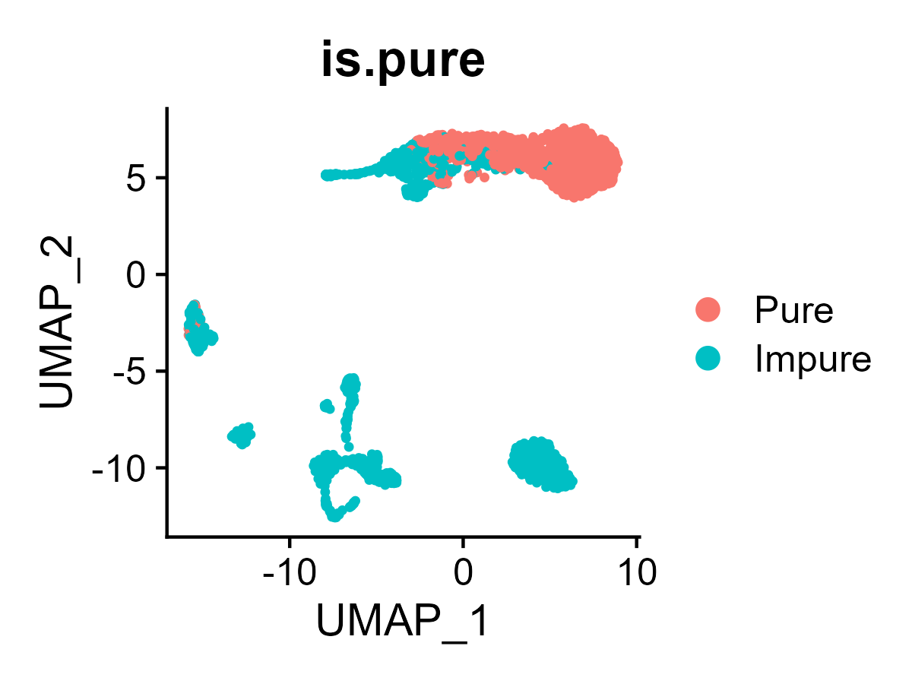
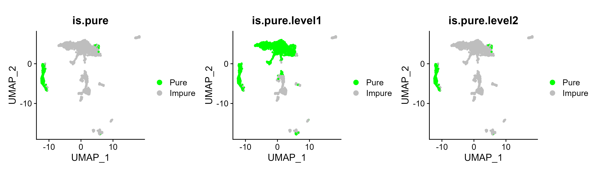
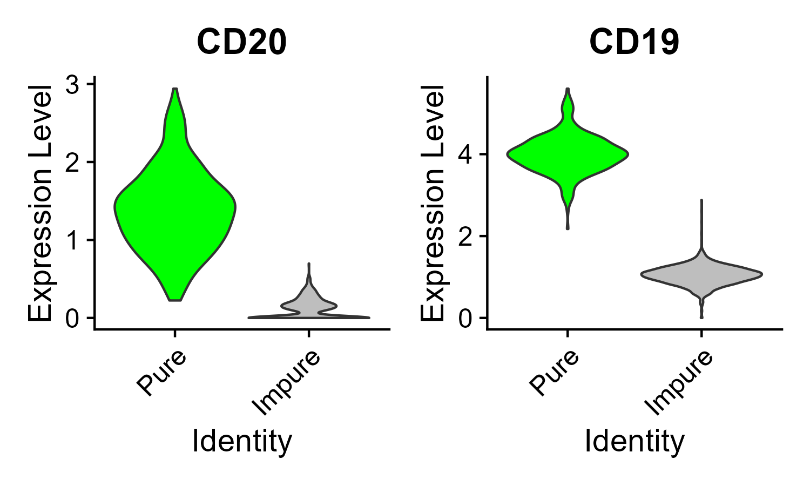

## ProjecTME Manual

```r
# Run in R4.0 +
library(Seurat)
library(dplyr)
library(ggplot2)
source('script/main.r')
source('script/utils.r')
source('script/ext.r')
```

### UCell: Robust and scalable single-cell gene signature scoring

UCell is used for scoring gene signatures in single-cell datasets. UCell scores, based on the Mann-Whitney U statistic, are robust to dataset size and heterogeneity, and their calculation demands relatively less computing time and memory than other robust methods, enabling the processing of large datasets (>10^5 cells). UCell can be applied to any cel vs. gene data matrix, and includes functions to directly interact with Seurat and Bioconductor's SingleCellExperiment objects.

```r
load('data/sample.matrix.RData')
gene.sets <- list(
  Tcell_signature = c('CD2','CD3E','CD3E'), Myeloid_signature = c('SPI1','FCER1G','CSF1R'),
  cellcycle_G1S = c(
    'ATAD2','BLM','BRIP1','CASP8AP2','CCNE2','CDC45','CDC6','CDCA7','CHAF1B','CLSPN','DSCC1','DTL',
    'E2F8','EXO1','FEN1','GINS2','GMNN','HELLS','MCM2','MCM4','MCM5','MCM6','MSH2','NASP','PCNA',
    'POLA1','POLD3','PRIM1','RAD51','RAD51AP1','RFC2','RPA2','RRM1','RRM2','SLBP','TIPIN',
    'TYMS','UBR7','UHRF1','UNG','USP1','WDR76'
  ),
  cellcycle_G2M = c(
    'ANLN','ANP32E','AURKA','AURKB','BIRC5','BUB1','CBX5','CCNB2','CDC20','CDC25C','CDCA2','CDCA3',
    'CDCA8','CDK1','CENPA','CENPE','CENPF','CKAP2','CKAP2L','CKAP5','CKS1B','CKS2','CTCF','DLGAP5',
    'ECT2','G2E3','GAS2L3','GTSE1','HJURP','HMGB2','HMMR','KIF11','KIF20B','KIF23','KIF2C','LBR',
    'MKI67','NCAPD2','NDC80','NEK2','NUF2','NUSAP1','PSRC1','RANGAP1','SMC4','TACC3','TMPO','TOP2A',
    'TPX2','TTK','TUBB4B','UBE2C'
  ),
  IFN = c(
    'BISPR','GVINP1','GVINP2','IFI6','IFI16','IFI27','IFI27L1','IFI27L2','IFI35','IFI44','IFI44L',
    'IFIH1','IFIT1','IFIT1B','IFIT1P1','IFIT2','IFIT3','IFIT5','IFIT6P','IFITM1','IFITM2','IFITM3',
    'IFITM4P','IFITM5','IFITM8P','IFITM9P','IFITM10','IFNA1','IFNA2','IFNA4','IFNA5','IFNA6','IFNA7',
    'IFNA8','IFNA10','IFNA11P','IFNA12P','IFNA13','IFNA14','IFNA16','IFNA17','IFNA20P','IFNA21',
    'IFNA22P','IFNAR1','IFNAR2','IFNB1','IFNE','IFNG','IFNGR1','IFNGR2','IFNK','IFNL1','IFNL2','IFNL3',
    'IFNL3P1','IFNL4','IFNL4P1','IFNLR1','IFNNP1','IFNW1','IFNWP2','IFNWP4','IFNWP5','IFNWP9','IFNWP15',
    'IFNWP18','IFNWP19','IFRD1','IFRD2','IRF1','IRF2','IRF2BP1','IRF2BP2','IRF2BPL','IRF3','IRF4','IRF5',
    'IRF5P1','IRF6','IRF7','IRF8','IRF9','ISG20','ISG20L2','LUARIS','MAILR','NRIR','PRKRA','STING1','AIF1',
    'DNAJC3','IFI30','IL6','IL18','MX1','MX2','PRRT1','PRRT2','RSAD2','SHFL','SYNDIG1','SYNDIG1L',
    'TICAM1','TMEM91','TMEM233','TRARG1'
  ),
  Tcell_cytotoxicity = c('GZMB','PRF1','FASLG'), Tcell_stemness = c('TCF7','SELL','LEF1','IL7R'),
  Tcell_exhaustion = c('HAVCR2','CTLA4','PDCD1','TIGIT','LAG3')
)

scores <- ScoreSignatures_UCell(sample.matrix, features = gene.sets)
scores[1:10,1:2]
```

```
                       Tcell_signature_UCell Myeloid_signature_UCell
 L5_ATTTCTGAGGTCGTGA               0.8946667                       0
 L4_TCACTATTCATCTCTA               0.6041667                       0
 L1_TCCTTCTTCTTTACAC               0.4403333                       0
 L5_AAAGTGAAGGCGCTCT               0.4568333                       0
 E2L3_CCTCAGTAGTGCAGGT             0.8208333                       0
 L5_CCCTCTCGTTCTAAGC               0.5330000                       0
```

#### Single-cell gene signature scoring with UCell (UCell signature enrichment analysis)

In this part, we will apply UCell to evaluate gene signatures in single-cell dataset from 31 tumor biopsies of melanoma patients, sequenced using the Smart-seq2 protocol.

##### scRNA-seq data preparation

Download the gene expression matrix from Gene Expression Omnibus - GSE115978.

```r
library(GEOquery)
if(!file.exists('Vignettes/data/GSE115978.rds.gz')){
  geo_acc <- 'GSE115978'
  options(timeout = max(1000, getOption('timeout')))
  gse <- getGEO(geo_acc)
  getGEOSuppFiles(geo_acc)
  exp.mat <- read.csv(sprintf('%s/GSE115978_counts.csv.gz',geo_acc),header = T,row.names = 1,sep = ',')
  readr::write_rds(exp.mat, file = 'Vignettes/data/GSE115978.rds.gz',compress = 'gz')
}else{
  exp.mat <- readr::read_rds('Vignettes/data/GSE115978.rds.gz')
}
```

##### Define gene signatures

Here we define some simple gene sets based on 'Human Cell Landscape' signatures Han et al.(2020) Nature.

```r
signatures <- list(
  Immune = c('PTPRC'),
  Macrophage = c('CTSB','C1QB','LAPTM5','TYROBP','PSAP','C1QA','HLA-DRA','CTSD','NPC2','FCER1G'),
  Tcell = c('CD3D','CD3E','CD3G','CD2'),
  Bcell = c('MS4A1','CD79A','CD79B','CD19','BANK1'),
  Myeloid_cell = c('CD14','LYZ','CSF1R','FCER1G','SPI1','LCK-'),
  Stromal = c('MMP2','COL1A1','COL1A2','COL3A1','LUM','DCN')
)
```

##### Run UCell


##### Pre-calculating gene rankings

The time- and memory-demanding step in UCell is the calculation of gene rankings for each individual cell. If we plan to experiment with signatures, editing them or adding new cell subtypes, it is possible to pre-calculate the gene rankings once and for all and then apply new signatures over these pre-calculated ranks.

```r
set.seed(123)
ranks <- StoreRankings_UCell(exp.mat)
ranks[1:5,1:5]
```

Then, we can apply our signature set, or any other new signature to the pre-calculated ranks. The calculations will be considerably faster.

```r
set.seed(123)
u.scores.2 <- ScoreSignatures_UCell(features = signatures, precalc.ranks = ranks)
melted <- reshape2::melt(u.scores.2)
colnames(melted) <- c('Cell', 'Signature', 'UCell_score')
ggplot(melted, aes(x = Signature, y = UCell_score)) +
  geom_violin(aes(fill=Signature),scale = 'width') +
  geom_boxplot(width = 0.1, outlier.size = 0) +
  theme_bw() + theme(axis.text.x = element_blank())
```


```r
new.sig <- list(
  Mast.cell = c('TPSAB1','TPSB2','CPA3','SRGN','RGS2','RGS1','NFKBIA','GLUL','VIM','ANXA1'),
  Erythroid.cell = c('HBA2','HBG2','HBA1','HBB','HBG1','AHSP','ALAS2','SLC25A37','HBM')
)
u.scores.3 <- ScoreSignatures_UCell(features = new.sig, precalc.ranks = ranks)
melted <- reshape2::melt(u.scores.3)
colnames(melted) <- c('Cell', 'Signature', 'UCell_score')
ggplot(melted, aes(x = Signature, y = UCell_score)) +
  geom_violin(aes(fill=Signature),scale = 'width') +
  geom_boxplot(width = 0.1, outlier.size = 0) +
  theme_bw() + theme(axis.text.x = element_blank())
```


##### Multi-core processing

If your machine has multi-core capabilities and enough RAM, running UCell in parallel can speed up considerably your analysis.

```r
u.scores <- ScoreSignatures_UCell(exp.mat, features = signatures, ncores = 4)
melted <- reshape2::melt(u.scores)
colnames(melted) <- c('Cell', 'Signature', 'Uscore')
ggplot(melted, aes(x = Signature, y = Uscore)) +
  geom_violin(aes(fill=Signature),scale = 'width') +
  geom_boxplot(width = 0.1, outlier.size = 0) +
  theme_bw() + theme(axis.text.x = element_blank())
```


##### Interacting with SingleCellExperiment or Seurat

**UCell + SingleCellExperiment**

The function `ScoreSignatures_UCell()` allows operating directly on `sce` objects. UCell scores are returned in a altExp object (`altExp(sce,'UCell')`).

```r
library(SingleCellExperiment)
sce <- SingleCellExperiment(list(counts = exp.mat))
sce <- ScoreSignatures_UCell(sce,features = signatures, assay = 'counts', name = NULL, ncores = 4)
altExp(sce, 'UCell')
# Dimensionality reduction and visualization
library(scater)
library(patchwork)
# PCA
sce <- logNormCounts(sce)
sce <- runPCA(sce, scale = T, ncomponents = 20)
# UMAP
set.seed(1234)
sce <- runUMAP(sce, dimred = 'PCA')
plst <- lapply(names(signatures), function(x){
  plotUMAP(sce,colour_by = x, by_exprs_values = 'UCell', text_size = 10)
})
patchwork::wrap_plots(plst)
```


##### UCell + Seurat

The function `AddModuleScore_UCell()` allows operating directly on Seurat objects. UCell scores are returned as metadata columns in the Seurat object.

```r
library(Seurat)
seu <- CreateSeuratObject(counts = exp.mat, project = 'JerbyArnon')
seu <- AddModuleScore_UCell(seu,features = signatures,name = NULL, ncores = 4)
head(seu@meta.data)
# Generate PCA and UMAP embeddings
seu <- NormalizeData(seu)
seu <- FindVariableFeatures(seu, selection.method = 'vst', nfeatures = 500)
seu <- ScaleData(seu)
seu <- RunPCA(seu, features = seu@assays$RNA@var.features, npcs = 20)
seu <- RunUMAP(seu, reduction = 'pca', dims = 1:20, seed.use = 123)
# Visualize UCell scores on low-dimensional representation (UMAP)
FeaturePlot(seu, reduction = 'umap', features = names(signatures), ncol = 3, order = T,cols = PurpleAndYellow())
```


#### Using UCell with Seurat objects (UCell signature enrichment - interacting with Seurat)

In this demo, we will apply UCell to evaluate gene signatures in single-cell PBMC data. We will use a subset of the data from [Hao et al,Cell.2020](https://pubmed.ncbi.nlm.nih.gov/34062119/), which comprises multiple immune cell types at different levels of resolution. Because these cells were characterized both in terms of transcriptomes (using scRNA-seq) and surface proteins (using a panel of antibodies), the cell type annotations should be of very high quality. To demonstrate how UCell can simply and accurately evaluate gene signatures on a query dataset, we will apply it directly to the Seurat object from Hao et al. and compare the signature scores to the original cluster annotations by the authors.

The [original dataset](https://atlas.fredhutch.org/data/nygc/multimodal/pbmc_multimodal.h5seurat) is very large (>160K cells), for this illustrative example we used a downsampled version (20,000 cells), and then further subset on T cell only (9,074 cells).

##### Query single-cell data

```r
pbmc.Tcell <- readRDS('Vignettes/data/pbmc_multimodal.downsampled20k.Tcell.seurat.RNA.rds')
DimPlot(pbmc.Tcell,reduction = 'wnn.umap',group.by = 'celltype.l2',label = T,label.size = 3,repel = T)
```


##### Score signature using UCell

Define some signatures for T cell subtypes

```r
markers <- list(
  Tcell_CD4 = c('CD4','CD40LG'), Tcell_CD8 = c('CD8A','CD8B'), 
  Tcell_Treg = c('FOXP3','IL2RA'), Tcell_MAIT = c('KLRB1','SLC4A10','NCR3'), 
  Tcell_gd = c('TRDC','TRGC1','TRGC2','TRDV1','TRAC-','TRBC1-','TRBC2-'),
  Tcell_NK = c('FGFBP2','SPON2','KLRF1','FCGR3A','KLRD1','TRDC','CD3E-','CD3G-')
)
pbmc.Tcell <- AddModuleScore_UCell(pbmc.Tcell, features = markers)
signature.names <- paste0(names(markers),'_UCell')
```

```r
VlnPlot(pbmc.Tcell, features = signature.names, group.by = 'celltype.l1')
```


```r
VlnPlot(pbmc.Tcell,features = signature.names,group.by = 'celltype.l2')
```


```r
FeaturePlot(pbmc.Tcell,reduction = 'wnn.umap',features = signature.names,ncol = 3,order = T)
```


##### Compare to `AddModuleScore` from Seurat

Seurat comes with a method for signature enrichment analysis, `AddModuleScore`. This method is very fast, but the score is highly dependent on the composition of the dataset. Here will apply `AddModuleScore` with a simple CD8 T cell signature to two datasets: a set composed of different T cell types (`pbmc.Tcell`) and a subset of this dataset only comprising the CD8T cells (`pbmc.Tcell.CD8`).

First, generate a subset only comprising CD8 T cells (pbmc.Tcell.CD8)

```r
Idents(pbmc.Tcell) <- 'celltype.l1'
pbmc.Tcell.CD8 <- subset(pbmc.Tcell, idents = c('CD8 T'))
DimPlot(pbmc.Tcell.CD8, reduction = 'wnn.umap', group.by = 'celltype.l2',label = T,
        label.size = 3, repel = T) + NoLegend()
```


Note that applying the same signature to the complete set or to the CD8 T subset gives very different results. When other cell types are present, the score distribution for CD8 T cells has a median close to 1, but the same CD8 T cell evaluated alone given a zero-centered distribution of scores. It may be indesirable to have a score that changes so dramatically for the same cells dependening of the composition of the dataset.

```r
markers.cd8 <- list(Tcell_CD8 = c('CD8A','CD8B'))
pbmc.Tcell <- AddModuleScore(pbmc.Tcell, features = markers.cd8, name = 'Tcell_CD8_Seurat')
a <- VlnPlot(pbmc.Tcell, features = 'Tcell_CD8_Seurat1')
pbmc.Tcell.CD8 <- AddModuleScore(pbmc.Tcell.CD8,features = markers.cd8,name = 'Tcell_CD8_Seurat')
b <- VlnPlot(pbmc.Tcell.CD8, features = 'Tcell_CD8_Seurat1')
a | b
```


```r
summary(subset(pbmc.Tcell, subset = celltype.l1 == 'CD8 T')$Tcell_CD8_Seurat1)
```

```
   Min. 1st Qu.  Median    Mean 3rd Qu.    Max. 
-0.6057  0.5149  0.9236  0.8756  1.2673  2.3228
```

```r
summary(pbmc.Tcell.CD8$Tcell_CD8_Seurat1)
```

```
    Min.  1st Qu.   Median     Mean  3rd Qu.     Max. 
-1.65105 -0.44921 -0.03485 -0.09280  0.30758  1.39551
```

UCell score is based on gene rankings and therefore is not affected by the composition of the query dataset. Note that the score distribution is nearly identical for the same cell population in different datasets (small differences are due to random resolution of rank ties).

```r
pbmc.Tcell <- AddModuleScore_UCell(pbmc.Tcell, features = markers.cd8)
a <- VlnPlot(pbmc.Tcell, features = 'Tcell_CD8_UCell')
pbmc.Tcell.CD8 <- AddModuleScore_UCell(pbmc.Tcell.CD8, features = markers.cd8)
b <- VlnPlot(pbmc.Tcell.CD8, features = 'Tcell_CD8_UCell')
a | b
```


```r
summary(subset(pbmc.Tcell, subset = celltype.l1 == 'CD8 T')$Tcell_CD8_UCell)
```

```
  Min. 1st Qu.  Median    Mean 3rd Qu.    Max. 
 0.0000  0.3803  0.5193  0.5294  0.7733  0.9372
```

```r
summary(pbmc.Tcell.CD8$Tcell_CD8_UCell)
```

```
  Min. 1st Qu.  Median    Mean 3rd Qu.    Max. 
 0.0000  0.3803  0.5193  0.5294  0.7733  0.9372
```

We can have a look at the distribution of the scores for all T cells

```r
a <- DimPlot(pbmc.Tcell, reduction = 'wnn.umap', group.by = 'celltype.l2',label = T,label.size = 3,repel = T)
b <- FeaturePlot(pbmc.Tcell,reduction = 'wnn.umap',features = c('Tcell_CD8_UCell','Tcell_CD8_Seurat1'),ncol = 2,order = T)
cowplot::plot_grid(plotlist = list(a,b),nrow = 1,rel_widths = c(1,2))
```


and on the CD8 T cell subset only

```r
a <- DimPlot(pbmc.Tcell.CD8, reduction = 'wnn.umap', group.by = 'celltype.l2',label = T,label.size = 3,repel = T)
b <- FeaturePlot(pbmc.Tcell.CD8,reduction = 'wnn.umap',features = c('Tcell_CD8_UCell','Tcell_CD8_Seurat1'),ncol = 2,order = T)
cowplot::plot_grid(plotlist = list(a,b),nrow = 1,rel_widths = c(1,2))
```


#### Using UCell and Seurat to identify different T cell subtypes/ states in human tumors (Evaluating human TIL subtype signatures using UCell)

Use UCell gene signature scoring to identify and filter tumor-infiltrating T cell subtypes.

##### Query single-cell data

Use data from [Yost et al. Nat Med 2019](https://www.ncbi.nlm.nih.gov/pmc/articles/PMC6689255/) pre-compiled [R object](https://drive.switch.ch/index.php/s/cluBLHkFFzLZWzL/download).

```r
inputFile <- 'Vignettes/data/Yost.pretreatment.all.rds'
if(!file.exists(inputFile)){
  download.file('https://drive.switch.ch/index.php/s/cluBLHkFFzLZWzL/download',inputFile)
  seu <- readRDS(inputFile)
}else{
  seu <- readRDS(inputFile)
}
seu <- NormalizeData(seu) %>% FindVariableFeatures() %>% ScaleData() %>% RunPCA() %>% RunUMAP(dims=1:30)
# Color by patient and original cluster annotations
a <- DimPlot(seu, group.by = 'patient')
b <- DimPlot(seu, group.by = 'cluster')
c <- DimPlot(seu, group.by = 'cluster.T')
a | b | c
```


##### Unsupervised clustering

```r
set.seed(123)
seu <- FindNeighbors(seu, reduction = 'pca', dims = 1:30)
seu <- FindClusters(seu, resolution = 0.7)
DimPlot(seu, reduction = 'umap',group.by = 'seurat_clusters',label = T) + NoLegend()
```


##### Score general cell type signatures using UCell

Apply UCell with human cell type signatures to identify major cell types. These signatures were extracted from [Han et al Nature 2020](https://www.nature.com/articles/s41586-020-2157-4) and further filtered.

```r
signaturesHumanCellTypes <- readRDS('Vignettes/data/signaturesHumanCellTypes.rds')
seu <- AddModuleScore_UCell(seu,features = signaturesHumanCellTypes)
# Some major cell types to look at:
toplot <- c('Macrophage','Fibroblast','T.cell','Stromal.cell','B.cell','Myeloid.cell','Endothelial.cell.1','NK')
featnames <- paste0(toplot,'_UCell')
FeaturePlot(seu,features = featnames,pt.size = 0.1,max.cutoff = 'q99',ncol = 4)
```


```r
VlnPlot(seu,features = featnames,pt.size = 0,split.by = 'seurat_clusters',ncol = 4)
```


##### Identify T cells based on signatures and subset them

Identify T cell clusters by UCell score

```r
# select as Tcell clusters only those with median UScore > 0.2
medians <- sapply(levels(seu$seurat_clusters),function(x){
  median(seu@meta.data[seu$seurat_clusters==x,'T.cell_UCell'])
})
tcell.clusters <- names(medians[medians > 0.2])
# Add metadata
seu$is.Tcell <- FALSE
seu@meta.data[seu$seurat_clusters %in% tcell.clusters, 'is.Tcell'] <- TRUE
DimPlot(seu, group.by = 'is.Tcell')
```


```r
# Subset on T cells
seu.tcells <- subset(seu, subset = is.Tcell == TRUE)
# Recalculate embeddings only for filtered T cells
seu.tcells <- NormalizeData(seu.tcells) %>% FindVariableFeatures() %>% ScaleData() %>% RunPCA() %>% RunUMAP(dims=1:20)
# By patient and by annotation from original study
a <- DimPlot(seu.tcells, group.by = 'patient')
b <- DimPlot(seu.tcells, group.by = 'cluster.T')
c <- DimPlot(seu.tcells, group.by = 'seurat_clusters')
a | b | c
```


##### Score TIL subtype-specific signatures using UCell

Now we can apply UCell using signatures specific for distinct T cell subtypes.

```r
signatureHumanTILs <- readRDS('Vignettes/data/signaturesHumanTILs.rds')
signatureHumanTILs[['cycling']] <- c('TOP2A','MKI67','STMN1')
seu.tcells <- AddModuleScore_UCell(seu.tcells,features = signatureHumanTILs)
featnames <- paste0(names(signatureHumanTILs), '_UCell')
FeaturePlot(seu.tcells, features = featnames, pt.size = 0.1,order = T,ncol = 3)
```


```r
VlnPlot(seu.tcells,features = featnames,pt.size = 0,split.by = 'seurat_clusters',ncol = 3)
```


##### Compare TIL subtype signature scores against original annotation

Now we can assess gene signature scores (their average values) in each T cell cluster as defined by Yost et al. An overall agreement between T cell subtypes defined by Yost and the corresponding gene signature scores can be observed. For example, CD8_eff and CD8_mem both with high CD8_EffectorMemory score, CD8_ex_act and CD_ex with highest CD8_Tex score, Treg with highest Treg score and Th17 with highest Thelper score. Instead, other Yost clusters seem to be more heterogeneous/ambiguously defined, e.g. CD8_act with both high CD8_EffectorMemory and CD4 Thelper scores, and Naive cluster with high Thelper signal.

```r
TILsigScores <- seu.tcells@meta.data[,featnames]
TILsigScores_vs_OriginalCluster <- TILsigScores %>%
  filter(!is.na(seu.tcells@meta.data$cluster.T)) %>%
  group_by(seu.tcells@meta.data$cluster.T[!is.na(seu.tcells$cluster.T)]) %>%
  summarise_each(mean)
TILsigScores_vs_OriginalCluster.m <- as.matrix(TILsigScores_vs_OriginalCluster[,-1])
rownames(TILsigScores_vs_OriginalCluster.m) <- TILsigScores_vs_OriginalCluster[,1][[1]]
heatmap(t(TILsigScores_vs_OriginalCluster.m), cexCol = 0.7, scale = 'none')
```


### scGate: marker-based purification of cell types from heterogeneous single-cell RNA-seq datasets

scGate automatizes the typical manual marker-based approach to cell type annotation, to enable accurate and intuitive purification of a cell population of interest from a complex scRNA-seq dataset, without requiring reference gene expression profiles or training data. scGate works with any scRNA-seq technology and with other single-cell modalities.

Briefly, scGate takes as input: i) a gene expression matrix stored in a Seurat object and ii) a "gating model" (GM), consisting of a set of marker genes that define the cell population of interest. The GM can be as simple as a single marker gene, or a combination of positive and negative markers. More complex GMs can be constructed in a hierarchical fashion, akin to gating strategies employed in flow cytometry.

scGate evaluates the strength of signature marker expression in each cell using the rank-based method UCell, and then performs k-nearest neighbor (kNN) smoothing by calculating the mean UCell score across neighboring cells. kNN-smoothing aims at compensating for the large degree of sparsity in scRNA-seq data. Finally, a universal threshold over kNN-smoothed signature scores is applied in binary decision trees generated from the user-provided gating model, to annotate cells as either "pure" or "impure", with respect to the cell population of interest.

```r
library(Seurat)
library(dplyr)
library(ggplot2)
source('script/main.r')
source('script/utils.r')
source('script/ext.r')
```

##### Testing

Use scGate to purify a cell popualtion of interest using manually defined marker genes.

```r
sample.data.seu.list <- readRDS('data/testing.datasets.2k.rds')
seu.obj <- sample.data.seu.list$Satija
# Manually define a simple scGate model to purify eg. NK cells, using a positive marker
# KLRD1 and negative marker CD3D
my_scGate_model <- gating_model(name = 'NK', signature = c('KLRD1','CD3D-'))
seu.obj <- scGate(data = seu.obj, model = my_scGate_model)
# Use Seurat t visualize 'Pure' and 'Impure' cells
p1 <- DimPlot(seu.obj, group.by = 'is.pure')
# Use Seurat to subset pure cells
seu.obj.purified <- subset(seu.obj, subset = `is.pure` == 'Pure')
```



##### Pre-defined Gating models

A database of gating models for scGate was in-built.

```r
scGate_models_DB <- readRDS('data/models.rds')
# Filter abT cells using one of scGate pre-defined gating models
seu.obj <- scGate(seu.obj,model = scGate_models_DB$human$generic$Tcell.alphabeta)
featname <- scGate_models_DB$human$generic$Tcell.alphabeta$name[c(2,3,4,5,8,9,10,14,15)]
featname <- paste0(featname,'_UCell')
VlnPlot(seu.obj,features = featname,group.by = 'celltype.l1',ncol = 3,pt.size = 0)
```


Use `plot_tree` function to visualize the hierarchical structure of one of the models.

```r
plot_tree(scGate_models_DB$human$generic$Tcell.alphabeta)
```


##### scGate as a multi-class classifier

scGate can also be used as a cell type classifier, to annotate multiple cell types in a dataset. To annotate a dataset with marker-based cell type definitions, simply provide a list of models.

```r
models.lits <- scGate_models_DB$human$generic[c('Bcell','MoMacDC','CD8T','CD4T','Erythrocyte')]
seu.obj <- scGate(seu.obj, model = models.lits)
```

#### scGate as a multi-class classifier

This demo illustrates the main functionalities of the scGate pipeline for purifying cell type populations of interest from heterogeneous single-cell datasets. We start from basic, single-gene filters and move gradually to more complex hierarchical models composed of multi-gene signatures.

##### Loading demo datasets

Let's play with a (downsampled) dataset of PBMCs from [Hao et al.2021](https://doi.org/10.1016/j.cell.2021.04.048)

```r
testing.datasets <- readRDS('data/testing.datasets.2k.rds')
seu.obj <- testing.datasets[['Satija']]
DimPlot(seu.obj,label = T,repel = T,group.by = 'celltype.l1') + 
  theme(legend.position = 'none', aspect.ratio = 1)
```


##### Creating a simple gating model

Now let's setup a simple scGate gating model to purify a population of interest-**B cells**.  B cells are usually identified by the expression of CD20, encoded by `MS4A1`.

```r
my_scGate_model <- gating_model(name = 'Bcell',signature = c('MS4A1'))
my_scGate_model
#   levels   use_as  name signature
# 1 level1 positive Bcell     MS4A1

# Run scGate to purify B cells with the simple single-gene model
seu.obj <- scGate(data = seu.obj, my_scGate_model, verbose = T)
DimPlot(seu.obj, cols = c(list(Impure = 'gray', Pure = 'green'))) + theme(aspect.ratio = 1)
```


Because in this demo example we know the ground truth cell types (at least, as defined by the authors), we evaluate scGate predictive performance in terms of precision/positive predictive value, recall.sensitivity, and accuracy using Mattews Correlation Coefficient (MCC).

```r
performance.metrics(grepl('^B ',seu.obj$cell_type),seu.obj$is.pure=='Pure')
#      PREC       REC       MCC 
# 0.9967742 0.9967742 0.9961825
```

With this very simple model, >99% (Recal) are isolated with a >99% purity (Precision), and overall classification performance (MCC) >99%.

Another example: we can isolate plasmacytoid dendritic cells (pDCs), defined using the marker LILRA4 (e.g. https://pubmed.ncbi.nlm.nih.gov/30395816/)

```r
my_scGate_model <- gating_model(name = 'pDC', signature = c('LILRA4'))
seu.obj <- scGate(data = seu.obj, model = my_scGate_model)
DimPlot(seu.obj, cols = c(list(Impure = 'gray', Pure = 'green'))) + theme(aspect.ratio = 1)
```


```r
performance.metrics(seu.obj$cell_type=='pDC',seu.obj$is.pure=='Pure')
# PREC  REC  MCC 
#    1    1    1
```

##### Gating models with positive and negative markers

Natural killer cells (NKs) are characterized by the marker KLRD1. However, KLRD1 can also be expressed by some T cell subsets. To improve sensitivity to isolate NKs, we can include in our gating strategy "negative" T cell markers such as CD3D.

```r
my_scGate_model <- gating_model(name = 'NK', signature = c('NCAM1+','KLRD1+','CD3D-'))
seu.obj <- scGate(data = seu.obj, model = my_scGate_model,assay = DefaultAssay(seu.obj))
DimPlot(seu.obj, cols = c(list(Impure = 'gray', Pure = 'green'))) + theme(aspect.ratio = 1)
```


```r
performance.metrics(grepl('^NK',seu.obj$cell_type),seu.obj$is.pure=='Pure')
#      PREC       REC       MCC 
# 1.0000000 0.9481132 0.9707296
```

##### Hierarchical gating models

In the examples above, we have been using a single-cell dataset derived from blood (PBMC). When working with more complex tissues, such as tumors, we might need to apply multiple levels of gating to isolate the population of interest, scGate allows to purify by steps, using a hierarchical gating model- for example, first purifying immune cells, and among the immune cells the cell type of interest.

Let's explore (a downsampled version of) the whole tumor dataset by [Jerby-Arnon et al., 2018](https://pubmed.ncbi.nlm.nih.gov/30388455/), with the cell type annotations provided by the authors.

```r
seu.obj <- testing.datasets$JerbyArnon
DimPlot(seu.obj, label = T,repel = T,group.by = 'cell_type') +
  theme(legend.position = 'none', aspect.ratio = 1)
```


The dataset comprises non-immune populations such as malignant/cancer cells (Mal), Endothelial cells (Endo) and cancer-associated fibroblasts (CAF). We can try to purify first all immune cells, using pan-immune cell marker CD45 (encoded by the gene PTPRC).

```r
my_scGate_model <- gating_model(name = 'immune', signature = c('PTPRC'))
seu.obj <- scGate(data = seu.obj, model = my_scGate_model, verbose = T)
DimPlot(seu.obj, cols = c(list(Impure = 'gray', Pure = 'green'))) + theme(aspect.ratio = 1)
```


```r
performance.metrics(seu.obj$cell_type %in% c('B.cell','NK','T.CD4','T.CD8','T.cell','Macrophage'),seu.obj$is.pure=='Pure')
#      PREC       REC       MCC 
# 0.8999310 0.9775112 0.8014946
```

From the immune cells, we can generate a simple gating model to purify macrophages (using common markers CD68 & FCGR1A).

Instead of purifying macrophages directly from the whole tissue, we can set up a hierarchical scGate model to: i) isolate immune cells as in the previous example, ii) isolate macrophages from immune cells.

Hierarchical gating models can be specified in scGate using parameter "level", as follows: initialize model with one positive signature.

```r
my_scGate_model <- gating_model(name = 'immune', signature = c('PTPRC'), level = 1)
# add positive signature at second step
my_scGate_model <- gating_model(model = my_scGate_model, name = 'macrophage', 
                                signature = c('CD68','FCGR1A'), level = 2)
seu.obj <- scGate(data = seu.obj, model = my_scGate_model, save.levels = T)
DimPlot(seu.obj, cols = c(list(Impure = 'gray', Pure = 'green'))) + theme(aspect.ratio = 1)
```


```r
performance.metrics(seu.obj$cell_type %in% c('Macrophage'), seu.obj$is.pure == 'Pure')
#      PREC       REC       MCC 
# 0.9068826 0.9218107 0.9023599
```

Here we isolated 92% of macrophages with a 91% purity (according to annotation by Jerby-Arnon et al). We could easily improve PREC and REC by adding more positive and negative markers, respectively (e.g. removing lymphocytes).

We can always inspect the distribution of UCell scores calculated for each signature.

```r
FeaturePlot(seu.obj, features = c('macrophage_UCell')) + viridis::scale_color_viridis(option = 'D')
```


```r
patchwork::wrap_plots(plot_levels(seu.obj))
```



##### Evaulation of model performance

```r
my_scGate_model <- gating_model(name = 'Bcell', signature = c('MS4A1'))
panBcell.performance <- test_my_model(my_scGate_model, target = 'Bcell')
panBcell.performance$performance
#                 PREC       REC       MCC
# JerbyArnon 0.8550725 0.9711934 0.8984003
# Zilionis   0.9572193 0.9521277 0.9499812
# Satija     0.9967742 0.9967742 0.9961825
```

In one of the datasets, precision was not optimal (85%). We can refine it, for instance, by removing potentially contaminating T cell genes (CD3D) and try again.

```r
my_scGate_model <- gating_model(model = my_scGate_model,name = 'Tcell',signature = ('CD3D'),negative = T)
panBcell.performance <- test_my_model(my_scGate_model, target = 'Bcell')
panBcell.performance$performance
#                 PREC       REC       MCC
# JerbyArnon 0.9446809 0.9135802 0.9193858
# Zilionis   0.9572193 0.9521277 0.9499812
# Satija     0.9967638 0.9935484 0.9942680
```

Predictive performance is now very high for the three sample datasets.

##### Pre-defined gating models

```r
models.DB <- readRDS('data/models.rds')
my_scGate_model <- models.DB$human$generic$Plasma_cell
plot_tree(my_scGate_model)
```


At each level in the tree, UCell scores are evaluated both for positive and negative signatures. Only cells with sufficiently high UCell scores for at least one positive signature, and consistently low UCell scores for all negative signatures will be passed on the next level in the tree. Upon reaching the final branch of the tree, only cells that passed all gating levels are labeled as "Pure" for the population of interest. We can run the Plasma cell model on the whole-tumor dataset by [Zilionis et al](https://doi.org/10.1016/j.immuni.2019.03.009).

```r
seu.obj <- testing.datasets$Zilionis
DimPlot(seu.obj, group.by = 'cell_type', label = T, repel = T, label.size = 3) +
  theme(aspect.ratio = 1) + ggtitle('Original manual annotation') + NoLegend()
```


Run scGate with `save.levels = TRUE` to output per-level results

```r
seu.obj <- scGate(seu.obj, model = my_scGate_model, save.levels = T)
DimPlot(seu.obj, cols = c(list(Impure='gray',Pure='green'))) + theme(aspect.ratio = 1)
```


Visualize filtering results by level. We can see how the purity increases at each level

```r
plots <- plot_levels(seu.obj)
patchwork::wrap_plots(plots, ncol = 2)
```


```r
performance.metrics(actual = seu.obj$Plasma_cell, pred = seu.obj$is.pure == 'Pure')
#      PREC       REC       MCC 
# 0.9255319 0.9456522 0.9323972
```

##### scGate as a multi-class classifier

scGate can also be used as a cell type classifier, to annotate multiple cell types in a dataset. Simply provide a list of models (one for each cell type of interest) to scGate and these will be jointly evaluated (faster than computing them individually). For instance, we use a list of models from the default scGate DB.

```r
models.DB <- readRDS('data/models.rds')
models.hs <- models.DB$human$generic
models.list <- models.hs[c('Bcell', 'CD4T', 'CD8T', 'MoMacDC', 'Plasma_cell', 'NK')]
# Then we can urn scGate with this list of models
seu.obj <- testing.datasets$Zilionis
seu.obj <- scGate(seu.obj, model = models.list)
```

Cells that are unequivocally assigned to only one cell type will be annotated to that cell type; cells that pass the gate of more than one model will be annotated as "Multi"; cells that cannot be gated by any model will be labeled as NA. These labels are exported in a new metadata column named `scGate_multi`.

```r
table(seu.obj$scGate_multi, useNA = 'ifany')
multi <- DimPlot(seu.obj, group.by= 'scGate_multi') + theme(aspect.ratio = 1)
orig <- DimPlot(seu.obj, group.by = 'cell_type', label = T, repel = T, label.size = 2) +
  theme(aspect.ratio = 1) + ggtitle('Original manual annot') + NoLegend()
orig | multi
```


We note that cell types for which a model was available were consistently annotated. In this example, we did not provide models for .e.g Neutrophils and Mast cells, so there cells were left unannotated. We leave it as an exercise to design models for these cell types based on markers from literature, and to increase the coverage of cells that can be confidently annotated.

##### Fast gating using pre-calculated dimensionality reduction

By default, scGate performs dimensionality reduction (DM) at each hierarchical level of the gating strategy, for sensitive kNN smoothing. However, if a pre-calculated DM is available in your input object, this can be provided to scGate to avoid this step and speed-up computations. This feature can be particularly useful to gate integrated datasets (eg after suing Harmony, Seurat or STACAS). Here we will run scGate using the pre-calculated pca space, by setting reduction = 'pca'.

```r
seu.obj <- scGate(seu.obj, model = models.list, reduction = 'pca')
multi <- DimPlot(seu.obj, group.by = 'scGate_multi') + theme(aspect.ratio = 1)
orig <- DimPlot(seu.obj, group.by = 'cell_type', label = T, repel = T, label.size = 2) +
  theme(aspect.ratio = 1) + ggtitle('Original manual annot') + NoLegend()
orig | multi
```


### scGate to annotate integrated scRNA-seq datasets

A typical task in single-cell analysis is cell type annotation of datasets composed of multiple samples. You may have used one of seeveral tools for batch-effect correction to integrate multiple samples, and generated a combined dataset. In this demo, we will show scGate can help you annotate an integrated dataset, by using simple, customizable models based on common marker genes for literature. We will show the case of a PBMC dataset integrated either with STACAS or Harmony, but the same applies to different integration tools.

##### scGate on STACAS-integrated object

Integrate different batches (in this example, datasets generated with different sequencing method) with `STACAS`.

```r
library(Seurat)
library(STACAS)
library(ggplot2)
library(dplyr)
library(harmony)
pbmcsca <- readRDS('Vignettes/data/pbmcsca.rds')
pbmcsca <- NormalizeData(pbmcsca)
pbmcsca.list <- SplitObject(pbmcsca, split.by = 'Method')
pbmc.stacas <- Run.STACAS(pbmcsca.list, anchor.features = 1000, dims = 1:20)
pbmc.stacas <- RunUMAP(pbmc.stacas, dims = 1:20)
DimPlot(pbmc.stacas, group.by = 'Method') + theme(aspect.ratio = 1)
```


We can run scGate directly on this integrated space, for instance to isolate NK cells.

```r
models.db <- readRDS('data/models.rds')
model.NK <- models.db$human$generic$NK
pbmc.stacas <- scGate(pbmc.stacas, model = model.NK, reduction = 'pca', ncores = 3,output.col.name = 'NK')
# We can compare the automatic filtering to the "CellType" manual annotation by the default.
DimPlot(pbmc.stacas, group.by = c('NK', 'CellType'), ncol = 2) + theme(aspect.ratio = 1)
```


New models can be easily defined based on cell type-specific markers from literature. For instance, we can set up a new simple model to identify Megakaryocytes.

```r
model.MK <- gating_model(name = 'Megakaryocyte', signature = c('ITGA2B', 'PF4', 'PPBP'))
pbmc.stacas <- scGate(pbmc.stacas, model = model.MK, reduction = 'pca', output.col.name = 'Megakaryocyte')
DimPlot(pbmc.stacas, group.by = c('Megakaryocyte', 'CellType'), ncol = 2) + theme(aspect.ratio = 1)
```


We can also run multiple gating models at once. Besides pure/impure classifications for each model, scGate will also return a combined annotation based on the models we provided. In this setting, scGate can be used as a multi-classifier to automatically annotate datasets.

```r
models.hs <- models.db$human$generic
models.list <- models.hs[c('Bcell','CD8T','MoMacDC','Plasma_cell','NK','Erythrocyte','Megakaryocyte')]
pbmc.stacas <- scGate(pbmc.stacas, model = models.list, reduction = 'pca')
DimPlot(pbmc.stacas, group.by = c('Method','CellType','scGate_multi'),ncol = 3) + theme(aspect.ratio = 1)
```


UCell scores for individual signatures are also available in metadata ("*_UCell" columns). These scores are useful to see which features contribute more strongly to particular gating model.

```r
FeaturePlot(pbmc.stacas,ncol = 3, features = c('Tcell_UCell','CD4T_UCell','CD8T_UCell','MoMacDC_UCell','pDC_UCell','Bcell_UCell'))
```


##### scGate on Harmony-integrated object

A very popular tool for single-cell data integration is Harmony. The `RunHarmony()`function provides a convenient wrapper to integrate samples stored in a Seurat object.

```r
pbmcsca <- NormalizeData(pbmcsca) %>%
  FindVariableFeatures(nfeatures = 1000) %>% ScaleData() %>% RunPCA(npcs = 20)
pbmc.harmony <- RunHarmony(pbmcsca, group.by.vars = 'Method')
# The corrected embeddings after batch effect correction will be stored in the "harmony" reduction slot
pbmc.harmony <- RunUMAP(pbmc.harmony, reduction = 'harmony', dims = 1:20)
```

Let's apply scGate in this space to isolate high-quality T cells

```r
models.db <- readRDS('data/models.rds')
model.Tcell <- models.db$human$generic$Tcell
pbmc.harmony <- scGate(pbmc.harmony,model = model.Tcell,reduction = 'harmony',output.col.name = 'Tcell')
DimPlot(pbmc.harmony,group.by = c('Tcell','CellType'),ncol = 2) + theme(aspect.ratio = 1)
```


We can also efficiently run multiple gating models at once, by providing a list of gating models.

```r
models.db <- readRDS('data/models.rds')
models.hs <- models.db$human$generic
models.list <- models.hs[c('Bcell','CD4T','CD8T','MoMacDC','Plasma_cell','NK','Erythrocyte','Megakaryocyte')]
pbmc.harmony <- scGate(pbmc.harmony, model = models.list, reduction = 'harmony')
DimPlot(pbmc.harmony,group.by = c('Method','CellType','scGate_multi'),ncol = 3) + theme(aspect.ratio = 1)
```


### Isolating target cell types from scATAC-seq data using scGate

This part illustrates the application of scGate to isolate different target cell population from scATAC-seq data.

For this demo, we will use a multi-modal dataset of paired ATAC and gene expression sequencing for human PBMCs, sequenced by 10x Chromium single-cell multi-ome technology. The data can be obtained directly from the 10x website: [single-cell-multiome-atac-gex](https://support.10xgenomics.com/single-cell-multiome-atac-gex/datasets/1.0.0/pbmc_granulocyte_sorted_10k?).

Make sure download the following files (and save them to the /data/pbmc_gra_atac):

- pbmc_granulocyte_sorted_10k_filtered_feature_bc_matrix.h5

- pbmc_granulocyte_sorted_10k_atac_fragments.tsv.gz

- pbmc_granulocyte_sorted_10k_atac_fragments.tsv.gz.tbi

To translate chromatin accessibility into per-gene measurements, we will apply the simple but effective approach implemented in Signac, which calculates "Gene activity" values by proximity of accessible peaks to gene body in terms of genomic coordinates. Other methods exists to infer per-gene counts from chromatin accessibility, and can be applied in the same manner as a pre-processing step to scGate.

```r
library(ggplot2)
library(dplyr)
library(viridis)
library(Seurat)
library(biovizBase)
library(Signac)
library(EnsDb.Hsapiens.v86)
```

##### Load multi-modal data

First, we will load the data for this demo, and store it in a Seurat object with two assays: one for gene expression data, the second for ATAC-seq data.

```r
inputdata.10x <- Read10X_h5('Vignettes/data/pbmc_gra_atac/pbmc_granulocyte_sorted_10k_filtered_feature_bc_matrix.h5')
# Extract RNA and ATAC data
rna_counts <- inputdata.10x$`Gene Expression`
atac_counts <- inputdata.10x$Peaks
# Create Seurat object on RNA counts
pbmc <- CreateSeuratObject(counts = rna_counts)
pbmc[['percent.mt']] <- PercentageFeatureSet(pbmc, pattern = '^MT-')
# Add in ATAC-seq data
grange.counts <- StringToGRanges(rownames(atac_counts), sep = c(':', '-'))
grange.use <- seqnames(grange.counts) %in% standardChromosomes(grange.counts)
atac_counts <- atac_counts[as.vector(grange.use),]
annotations <- GetGRangesFromEnsDb(ensdb = EnsDb.Hsapiens.v86)
# Formatting genome information and annotation
ucsc.lvls <- stringr::str_replace(string = paste0('chr',seqlevels(annotations)),'chrMT','chrM')
seqlevels(annotations) <- ucsc.lvls
genome(annotations) <- 'hg38'
seqlevelsStyle(annotations) <- 'UCSC'
# Load the fragment file
frag.file <- sprintf('Vignettes/data/pbmc_gra_atac/pbmc_granulocyte_sorted_10k_atac_fragments.tsv.gz')
chrom_assay <- CreateChromatinAssay(counts = atac_counts,sep = c(':','-'), fragments = frag.file,
                                    min.cells = 10, annotation = annotations)
pbmc[['ATAC']] <- chrom_assay
```

##### Pre-processing of GEX and ATAC data

A basic QC based can reveal outlier cells, which we will remove.

```r
VlnPlot(pbmc, features = c('nCount_RNA', 'nCount_ATAC', 'percent.mt'), ncol = 3, log = T, pt.size = 0) + NoLegend()
```


Set some reasonable thresholds according to observed data distributions, and remove outliers.

```r
pbmc <- subset(pbmc,subset = nCount_ATAC < 7e4 & nCount_ATAC > 5e3 & nCount_RNA < 25000 & nCount_RNA > 1000 & percent.mt < 20)
```

Standard pre-processing for the two data modalities is applied to normalize the data and calculate dimensionality reductions.

- GEX pre-processing using the SCT normalization protocol.

```r
DefaultAssay(pbmc) <- 'RNA'
pbmc <- SCTransform(pbmc) %>% RunPCA() %>% RunUMAP(dims=1:50,reduction.name='umap.rna',reduction.key='rnaUMAP_')
```

- ATAC pre-processing using the TF-IDF normalization, and signgular-value decomposition (SVD) for dimensionality reduction.

```r
DefaultAssay(pbmc) <- 'ATAC'
pbmc <- RunTFIDF(pbmc)
pbmc <- FindTopFeatures(pbmc, min.cutoff = 'q0')
pbmc <- RunSVD(pbmc)
pbmc <- RunUMAP(pbmc, reduction = 'lsi', dims = 2:50, reduction.name = 'umap.atac',reduction.key = 'ataUMAP_')
```

The `GeneActivity()` function from Signac allows calculating per-gene counts from ATAC counts. We will store this information in the 'GeneActivity' assay.

```r
gene.activities <- GeneActivity(pbmc)
# Add the gene activity matrix to the Seurat object as a new assay and normalize it
pbmc[['GeneActivity']] <- CreateAssayObject(counts = gene.activities)
pbmc <- NormalizeData(pbmc,assay = 'GeneActivity',normalization.method = 'LogNormalize',
                      scale.factor = median(pbmc$nCount_GeneActivity))
```

##### Low-dimensional representations

We can visualize Gene Activity counts for some classical immune markers in the UMAP space derived from ATAC counts.

```r
DefaultAssay(pbmc) <- 'GeneActivity'
feats <- c('LCK', 'CD3D', 'KLRD1', 'SPI1', 'MS4A1', 'CD36')
FeaturePlot(pbmc,features = feats, reduction = 'umap.atac', pt.size = 0.1, max.cutoff = 'q95',ncol = 3)
```


```r
# The same can be done for RNA counts
DefaultAssay(pbmc) <- 'SCT'
feats <- c('LCK', 'CD3D', 'KLRD1', 'SPI1', 'MS4A1', 'CD36')
FeaturePlot(pbmc,features = feats, reduction = 'umap.atac', pt.size = 0.1, max.cutoff = 'q95',ncol = 3)
```


##### scGate

On these processed data, we can now apply scGate to isolate target cell population based on ATAC-seq readouts or RNA expression. Importantly, we can use one modality for gating and the other modality as a validation. To gate based on ATAC counts, we will use the associated 'Gene Activity' values, which quantify the amount of accessible peaks per gene. Based on Gene Activity, how many genes are "expressed" in ATAC-seq?

```r
DefaultAssay(pbmc) <- 'GeneActivity'
VlnPlot(pbmc,features = c('nFeature_SCT','nFeature_RNA','nFeature_GeneActivity'),pt.size = 0)
```


```r
apply(pbmc@meta.data[, c('nFeature_SCT', 'nFeature_RNA', 'nFeature_GeneActivity')],2,median)
# nFeature_SCT          nFeature_RNA nFeature_GeneActivity 
#       1847.0                1849.5                6695.0
```

Compared to scRNA-seq, more genes have non-zero counts in ATAC-derived Gene Activities. We will adjust the maxRank parameter of scGate to reflect this different distribution of values, to approximately the median number of detected (non-zero) genes per cell.

For scRNA-seq, the default maxRank is 1500 (reflecting the number of detected genes).

```r
# Increase it for scATAC-seq based on the distribution of detected genes
maxRank.ATAC <- 7000
```

To verify presence of genetic signals, and test out signatures for target cell types, we can run UCell with custom signatures.

```r
signatures <- list(
  'Tcell' = c('CD3E', 'CD3G', 'CD3D', 'CD2'), 'Bcell' = c('MS4A1'),
  'NK' = c('KLRD1', 'NKG7', 'NCR1', 'FCGR3A', 'CD3D-', 'CD3E-', 'CD8A-', 'CD4-'),
  'Myeloid' = c('SPI1', 'CD36', 'LCK-'),
  'Monocyte' = c('LYZ', 'CD14', 'SPI1', 'MAFB', 'MSR1')
)
pbmc <- AddModuleScore_UCell(pbmc, features = signatures, assay = 'GeneActivity', maxRank = maxRank.ATAC)
FeaturePlot(pbmc, features = c('Tcell_UCell', 'Bcell_UCell', 'NK_UCell', 'Myeloid_UCell'),
                  reduction = 'umap.atac', max.cutoff = 'q95')
```


##### Purifying B cells

To filter B cells, we can set up a simple gating model based on the single gene MS4A1. We will specify `assay = 'GeneActivity'` to make scGate filter based on ATAC-derived counts.

```r
model <- gating_model(name = 'Bcell.ATAC', signature = c('MS4A1'))
# filter data
pbmc <- scGate(data = pbmc, model = model, assay = 'GeneActivity', output.col.name = 'Bcell.ATAC',maxRank = maxRank.ATAC)
# Visualize gating results
DimPlot(pbmc,group.by = 'Bcell.ATAC',reduction = 'umap.atac',
              cols = c(list('Impure'='gray','Pure'='green'))) +
  ggtitle('scGate B cells on ATAC') + theme(aspect.ratio = 1)
```


```r
DefaultAssay(pbmc) <- 'SCT'
a <- VlnPlot(pbmc,features = c('MS4A1'),assay = 'SCT',cols = c(list('Impure'='gray','Pure'='green')),pt.size = 0)
b <- FeaturePlot(pbmc,features = c('MS4A1'),reduction = 'umap.atac',pt.size = 0.1,max.cutoff = 'q95') +
  ggtitle('MS4A1 RNA-seq') + theme(aspect.ratio = 1)
a | b
```


##### Purifying T cells

Next, we aim to filter T cell population by using a signature composed of CD2 and CD3[edg] genes.

```r
model <- gating_model(name = 'Tcell.ATAC', signature = c('CD3E','CD3D','CD3G','CD2'))
# Filtering process
pbmc <- scGate(pbmc,model = model, assay = 'GeneActivity',output.col.name = 'Tcell.ATAC',maxRank = maxRank.ATAC)
DimPlot(pbmc, group.by = 'Tcell.ATAC', reduction = 'umap.atac',
              cols = c(list('Impure'='gray','Pure'='green'))) +
  ggtitle('scGate T cells on ATAC') + theme(aspect.ratio = 1)
```


```r
a <- VlnPlot(pbmc,features = c('CD3E','CD2'),assay = 'SCT',cols = c(list('Impure'='gray','Pure'='green')),pt.size = 0)
DefaultAssay(pbmc) <- 'SCT'
b <- FeaturePlot(pbmc,features=c('CD3E'),reduction = 'umap.atac',pt.size=0.1,max.cutoff='q95') +
  ggtitle('CD3E RNA-seq') + theme(aspect.ratio = 1)
a | b
```


##### Purifying Monocytes

Some cell populations may require more complex gating stragies.

To filter CD14+ monocytes, we will set up a two layer gating model: level 1 aims at isolating myeloid cells, level 2 purifies CD14+ monocytes from myeloid cells. This kind of hierarchical gating can be effortlessly using scGate, and mimicks gating strategies commonly applied in flow cytometry.

```r
model <- gating_model(name = 'Myeloid.ATAC', signature = c('SPI1', 'CD36', 'LCK-'))
model <- gating_model(model = model, name = 'Monocyte.ATAC',signature = c('CD14','MSR1','MAFB'),level = 2)
pbmc <- scGate(pbmc,model = model,assay = 'GeneActivity',output.col.name = 'Monocyte.ATAC',maxRank = maxRank.ATAC)
# Visualize gating results for each layer of the model
DimPlot(pbmc,group.by = 'Monocyte.ATAC',reduction = 'umap.atac',
             cols = c(list('Impure'='gray','Pure'='green'))) +
  ggtitle('CD14 Monocytes (ATAC)') + theme(aspect.ratio = 1)
```


```r
# Verify RNA expression of classical markers SPI1 (myeloid lineage) and CD14 (CD14 monocytes)
a <- VlnPlot(pbmc,features=c('SPI1','CD14'),assay='SCT',cols=c(list('Impure'='gray','Pure'='green')),pt.size=0,ncol=2)
DefaultAssay(pbmc) <- 'SCT'
b <- FeaturePlot(pbmc,features = c('SPI1'),reduction = 'umap.atac',pt.size = 0.1,max.cutoff = 'q95') +
  ggtitle('SPI1 RNA-seq') + theme(aspect.ratio = 1)
a | b
```


##### Purifying NK cells

To isolate NK cells, we can set up a gating model on two levels: level 1 to detect lymphoid cells; level 2 to purify NKs from the lymphoid subset.

```r
# Layer 1
model <- gating_model(name = 'Lymphocyte.ATAC', signature = c('LCK'), positive = T)
model <- gating_model(model = model, name = 'Myeloid.ATAC',signature = c('SPI1'),positive = F)
# Layer 2
model <- gating_model(model = model,name = 'NK.ATAC',signature = c('KLRD1','NCAM1','NCR1','CD8A-'),level = 2,positive = T)
model <- gating_model(model = model,name = 'Tcell.ATAC',signature = c('CD3G','CD3D','CD3E','CD2'),level = 2,positive = F)
pbmc <- scGate(pbmc,model = model,assay = 'GeneActivity',output.col.name = 'NK.ATAC',maxRank = maxRank.ATAC)
DimPlot(pbmc,group.by = 'NK.ATAC',reduction = 'umap.atac',
               cols = c(list('Impure'='gray','Pure'='green'))) +
  ggtitle('scGate NKs (ATAC)') + theme(aspect.ratio = 1)
```


```r
# Verify RNA expression of NK markers (KLRD1 & NCAM1) in pure/impure populations
a <- VlnPlot(pbmc,features = c('KLRD1', 'NCAM1', 'CD3D'), assay = 'SCT',
             cols = c(list('Impure'='gray','Pure'='green')),pt.size = 0,ncol = 3)
DefaultAssay(pbmc) <- 'SCT'
pl <- FeaturePlot(pbmc,features = c('KLRD1','CD3D'),reduction = 'umap.atac',pt.size = 0.1,max.cutoff = 'q95',combine = F)
pl[[1]] <- pl[[1]] + ggtitle('KLRD1 RNA-seq') + theme(aspect.ratio = 1)
pl[[2]] <- pl[[2]] + ggtitle('CD3D RNA-seq') + theme(aspect.ratio = 1)
pL <- patchwork::wrap_plots(pl)
a / pL
```


### Isolating target cell types from CITE-seq data using scGate

The CITE-seq dataset by Hao et al.2021 characterizes human PBMCs with scRNA-seq paired with antibody-derived tags (ADT) for a panel of >200 antibodies. This demo illustrates how the scGate can be applied to isolate target cell type populations from the different modalities in CITE-seq data.

```r
source('script/main.r')
source('script/ext.r')
source('script/utils.r')
library(dplyr)
library(Seurat)
library(viridis)
library(patchwork)
```

##### Load CITE-seq dataset

For simplicity, in this demo we use a reduced version of the dataset, downsampled to 2k cells. The same approach can be applied to the complete dataset.

```r
hao <- testing.datasets$Satija
# Let's have a look at the cell type annotations
DefaultAssay(hao) <- 'ADT'
DimPlot(hao, group.by = 'celltype.l1',label = T,repel = T,reduction = 'umap') + theme(aspect.ratio = 1)
```


##### scGate on CITE-seq data

Because CITE-seq contains two modalities (scRNA-seq & ADT counts), we can apply scGate on one modality and verify gating purity by measuring key markers in the second modality.

##### Purify B cells

Firstly, we build a simple gating model for B cells using the gene MS4A1 (encoding CD20).

```r
bcell.sct <- gating_model(name = 'Bcell.sct', signature = c('MS4A1'))
# And we can apply it on the SCT assay (which stores normalized RNA expression counts) of the Seurat object
hao <- scGate(hao, model = bcell.sct, assay = 'SCT', output.col.name = 'Bcell.SCT')
DimPlot(hao, group.by = 'Bcell.SCT', cols = c(list('Impure'='gray','Pure'='green'))) +
  theme(aspect.ratio = 1) + ggtitle('scGate Bcells (SCT assay)')
```


The surface protein measurements for key B cell markers CD19 and CD20 (stored in the ADT assay) 

```r
# confirm that scGate could isolate pure B cells from transcriptomics data.
VlnPlot(hao,features = c('CD20','CD19'),assay = 'ADT',cols = c(list('Impure'='gray','Pure'='green')),pt.size = 0)
```



We can now perform the complementary experiment: detecting B cells from ADT readouts (and confirming gating purity by RNA-seq expression)

```r
# Set up a simple gating model based on marker CD20.
cd20.adt <- gating_model(name = 'Bcell.adt', signature = c('CD20'))
```

Then apply this scGate model on the ADT assay. Note that, because ADT data are not sparse, and the dimensionality is much lower than scRNA-seq (up to a few hundred tags, compared to tens of thousands of genes in scRNA-seq), we will need to adjust the maxRank parameter. This parameter tells UCell how many variables to consider for ranking. For ADT data, the total number of tags divided by two is normally a reasonable choice.

```r
DefaultAssay(hao) <- 'ADT'
maxrank <- nrow(hao@assays$ADT)/2
hao <- scGate(hao,model = cd20.adt,assay = 'ADT',output.col.name = 'Bcell.ADT',maxRank = maxrank)
a <- DimPlot(hao,group.by = 'Bcell.ADT',cols = c(list('Impure'='gray','Pure'='green'))) +
  theme(aspect.ratio = 1) + ggtitle('scGate Bcells (ADT assay)')
# Verify RNA expression of MS4A1 (encoding CD20) in SCT assay
b <- VlnPlot(hao,features = 'MS4A1',assay = 'SCT',cols = c(list('Impure'='gray','Pure'='green')),pt.size = 0)
a | b
```


We can always examine the strength of the signatures in scGate models by plotting the UCell scores returned as part of the output. For example, for the Bcell.sct and Bcell.adt and Bcell.adt signatures, scores for all cells are available in the metadata slots Bcell.sct_UCell and Bcell.adt_UCell, respectively.

```r
DefaultAssay(hao) <- 'SCT'
a <- FeaturePlot(hao,features = c('Bcell.sct_UCell'),order = T) +
  scale_color_viridis(option = 'D') + theme(aspect.ratio = 1)
DefaultAssay(hao) <- 'ADT'
b <- FeaturePlot(hao,features = c('Bcell.adt_UCell'),order = T) +
  scale_color_viridis(option = 'D') + theme(aspect.ratio = 1)
a | b
```


##### Purify T cells

scGate allows us defining hierarchical models, mimicking a flow cytometry gating process.

```r
t.sct <- gating_model(name = 'lymphoid', signature = c('LCK'))
# Second level - filter on T cells markers (integrin alpha 2b expressed in endothelial cells,
# platelets, etc. but not T cells)
t.sct <- gating_model(model = t.sct, name = 't.sct',signature = c('CD3E','CD3D','ITGA2B-'),level = 2)
# Run scGate model on SCT assay
hao <- scGate(data = hao, model = t.sct, assay = 'SCT')
a <- DimPlot(hao,cols = c(list('Impure'='gray','Pure'='green'))) +
  theme(aspect.ratio = 1) + ggtitle('scGate Tcells (SCT assay)')
b <- VlnPlot(hao,features = c(grep('CD3-[1-2]',rownames(hao@assays$ADT),value = T),'CD41'),
             assay = 'ADT',cols = c(list('Impure'='gray','Pure'='green')),pt.size = 0,ncol = 3)
a | b
```


And conversely, generate a model to filter T cells based on ADT readouts.

```r
t.adt <- gating_model(name = 't.adt', signature = c('CD3-1','CD3-2','CD41-'))
hao <- scGate(hao, model = t.adt, assay = 'ADT', maxRank = maxrank)
DimPlot(hao,cols = c(list('Impure'='gray','Pure'='green'))) +
  ggtitle('scGate Tcells (ADT assay)') + theme(aspect.ratio = 1)
```


Almost all cells were filtered out by the method. When using ADT data, one needs to check if default positive/negative threshold (0.2) are appropriate.

```r
plot_UCell_scores(hao,model = t.adt)
```


The distribution in bimodal, but the default threshold pos.thr = 0.2 is too strict. Run again with pos.thr = 0.05.

```r
t.adt <- gating_model(name = 't.adt', signature = c('CD3-1','CD3-2','CD41-'))
hao <- scGate(hao,model = t.adt, assay = 'ADT', maxRank = maxrank, pos.thr = 0.05)
a <- DimPlot(hao,cols = c(list('Impure'='gray','Pure'='green'))) +
  theme(aspect.ratio = 1) + ggtitle('scGate Tcells (ADT assay)')
b <- VlnPlot(hao,features = c('CD3E','CD3D','ITGA2B'),assay = 'SCT',ncol = 3,
             cols = c(list('Impure'='gray','Pure'='green')),pt.size = 0)
a | b
```


##### Purify NK cells

```r
nk.sct <- gating_model(name = 'NK.sct', signature = c('NCAM1', 'KLRD1', 'CD3D-'))
hao <- scGate(hao,model = nk.sct,assay = 'SCT',output.col.name = 'NK.sct')
a <- DimPlot(hao,cols = c(list('Impure'='gray','Pure'='green'))) +
  theme(aspect.ratio = 1) + ggtitle('scGate NKs (SCT assay)')
b <- VlnPlot(hao,features = c('CD56-1','CD56-2','CD3-1','CD3-2'),assay = 'ADT',
             cols = c(list('Impure'='gray','Pure'='green')),pt.size = 0,ncol = 2)
a | b
```


Build and apply NK model for ADT assay

```r
# since KLRD1/CD94 is not available in Hao data, we will use the CD56 marker instead
nk.adt <- gating_model(name = 'NK.adt', signature = c('CD56-1', 'CD56-2'))
nk.adt <- gating_model(model = nk.adt,name = 'tcell.adt',signature = c('CD3-1','CD3-2'),negative = T)
hao <- scGate(hao,model = nk.adt,assay = 'ADT',maxRank = maxrank,pos.thr = 0.4,
              neg.thr = 0.7, output.col.name = 'NK.adt')
plot_UCell_scores(hao,model = nk.adt,pos.thr = 0.4,neg.thr = 0.7)
```


```r
a <- DimPlot(hao,cols = c(list('Impure'='gray','Pure'='green')),group.by = 'NK.adt') +
  theme(aspect.ratio = 1) + ggtitle('scGate NKs (ADT assay)')
b <- VlnPlot(hao,features = c('NCAM1','KLRD1','CD3D','CD3G'),assay = 'SCT',
             cols = c(list('Impure'='gray','Pure'='green')),pt.size = 0,ncol = 2)
a | b
```


##### Purify Platelets

```r
platelet.sct <- gating_model(name = 'platelet.sct', signature = c('ITGA2B'))
hao <- scGate(hao, model = platelet.sct, assay = 'SCT', output.col.name = 'platelet.sct')
a <- DimPlot(hao,cols = c(list('Impure'='gray','Pure'='green'))) +
  theme(aspect.ratio = 1) + ggtitle('scGate Platelets (SCT assay)')
b <- VlnPlot(hao,features = c('CD41'),assay = 'ADT',cols = c(list('Impure'='gray','Pure'='green')),
             pt.size = 0) + theme(aspect.ratio = 1)
a | b
```


Finally, we try to detect Platelets using ADT counts

Since CD41 could be expressed in monocytes and dendritic cells, we need to add a negative signature. Positive and negative signatures could present different UCell distributions when dealing with ADT data; again we need to adjust the thresholds for positive and negative UCell scores (the distribution plots can help you set a threshold).

```r
platelet.adt <- gating_model(name = 'platelet', signature = c('CD41'))
platelet.adt <- gating_model(model = platelet.adt,name = 'myeloid',signature = c('HLA-DR'),negative = T)
platelet.adt <- gating_model(model = platelet.adt,name = 'monocyte',signature = c('CD14','CD11c','CD11b-1','CD11b-2'),negative = T)
hao <- scGate(hao, model = platelet.adt, assay = 'ADT', maxRank = maxrank,pos.thr = 0.95,neg.thr = 0.6)
a <- DimPlot(hao, cols = c(list('Impure'='gray','Pure'='green'))) +
  ggtitle('scGate Platelets (ADT assay)') + theme(aspect.ratio = 1)
b <- VlnPlot(hao,features = c('ITGA2B'),assay = 'SCT',cols = c(list('Impure'='gray','Pure'='green')),
             pt.size = 0) + theme(aspect.ratio = 1)
a | b
```


### ProjecTME: A framework for reference-based single-cell RNA-seq data analysis

ProjecTME is a computational method to project scRNA-seq data into reference single-cell atlaes, enabling their direct comparison in a stable, annotated system of coordinates. In contrast to other methods, ProjecTME allows not only accurately embedding new scRNA-seq data into a reference without altering its structure, but also characterizing previously unknown cell states that "deviate" from the reference ProjecTME accurately predicts the effect of cell perturbations and identifies gene programs that are altered in different conditions and tissues. We can use ProjecTME pre-defined cell type-specific reference maps or create our own for any cell type[s] of interest.

#### 01-DEMO (Projecting scRNA-seq data onto a reference map)

This tutorial outlines the main functions implemented in ProjecTME on a small, simple dataset.

```r
library(Seurat)
library(dplyr)
library(ggplot2)
source('script/main.r')
source('script/utils.r')
source('script/ext.r')
```

##### Load reference atlas and query data

```r
ref <- readRDS('reference/ref_TILAtlas_mouse_v1.rds')
refCols <- c("#edbe2a","#A58AFF","#53B400","#F8766D","#00B6EB","#d1cfcc", "#FF0000","#87f6a5","#e812dd")
DimPlot(ref, label = T, cols = refCols)
```


```r
markers <- c('Cd4','Cd8a','Ccr7','Tcf7','Pdcd1','Havcr2','Tox','Izumo1r','Cxcr6','Xcl1','Gzmb','Gzmk','Ifng','Foxp3')
VlnPlot(ref, features = markers, stack = T,flip = T,assay = 'RNA')
```


Load query in-built dataset - Miller et al. Nature Immunol (2019)

```r
load('data/query_example_seurat.RData')
querydata1 <- get(load('data/query_example_seurat.RData'))
rm(query_example_seurat);gc()
# Load a query matrix with gene names and barcodes (e.g. 10X format or raw counts)
querydata2 <- read.sc.query(filename = 'Vignettes/data/GSE86028_TILs_sc_wt_mtko.tpm.log2.txt.gz',type = 'raw.log2')
```

##### Run Projection algorithm

The main function in ProjecTME is Run.ProjecTME, which takes as input a reference map and query dataset. The query will be batch-corrected and projected into the reference map, with low-dimensional embeddings (PCA & UMAP) compatible with those of the reference.

```r
query.projected <- Run.ProjecTME(query = querydata1, ref = ref)
```

NB: by default, Run.ProjecTME() will pre-filter T cell using scGate. In case the input dataset is already pre-filtered, we can disable this step using `Run.ProjecTME(querydata1,ref=ref,filter.cells=F)`. If we are using a custom reference map that is not composed of T cells, we may specify a different scGate filter using the scGate_model parameter.

##### Visualize projection

Plot projection of new data over the reference in UMAP space. The contour lines display the density of projected query cells onto the reference map.

```r
plot.projection(ref = ref, query = query.projected,linesize = 0.5,pointsize = 0.5)
```


Plot the predicted composition of the query in terms of reference T cell subtypes.

```r
plot.statepred.composition(ref = ref,query = query.projected,metric = 'Percent')
```


##### Compare gene expression

How do the gene expression levels compare between reference and query for the different cell states?

```r
plot.states.radar(ref = ref,query = query.projected,min.cells = 30)
```


##### Compare gene programs

We may want to compare query and reference for gene programs, rather than individual genes. For example, we can use signature stored in program.rds and calculate average signature scores per subtype.

```r
program <- readRDS('data/program.rds')
```

We obtain per-cell scores using UCell, and then generate radar plots on average signature scores per subtype.

```r
ref <- AddModuleScore_UCell(ref,features = program$Mm, assay = 'RNA', name = NULL)
query.projected <- AddModuleScore_UCell(query.projected,features = program$Mm,assay = 'RNA',name = NULL)
plot.states.radar(ref = ref,query = query.projected,meta4radar = names(program$Mm))
```


##### Compare cell states across conditions

If we have multiple conditions (eg. control vs. treatment, or samples from different tissues), we can search for discriminant genes between conditions (otherwise, by default this analysis is performed using the reference as the 'control').

Simulate a condition which e.g. *increases Gzmb expression compared to control*.

```r
query.control <- subset(query.projected, subset = Gzmb < 1.5)
query.perturb <- subset(query.projected, subset = Gzmb >= 1.5)
plot.states.radar(ref = ref,query = list(Control = query.control, Query = query.perturb))
```


In this toy example, where we simulated a condition that increases Gzmb expression compared to control, we expect cytotoxicity genes to drive differences.

```r
discriminantGenes <- find.discriminant.genes(
  ref = ref, query = query.perturb, query.control = query.control, state = 'CD8_Tex'
)
head(discriminantGenes, 10)
#                   p_val avg_log2FC pct.1 pct.2     p_val_adj
# Gzmb      1.161287e-109  0.9116129 1.000 0.803 3.175075e-105
# Gzmc       1.874772e-41  1.0003008 0.796 0.368  5.125813e-37
# AA467197   1.991773e-26  0.5614568 0.831 0.503  5.445707e-22
# Mt1        5.427822e-23  0.5235337 0.764 0.456  1.484021e-18
# Ccl9       6.506134e-20  0.6195337 0.481 0.124  1.778842e-15
# Serpinb6b  3.348957e-17  0.3956754 0.847 0.601  9.156382e-13
# Ccl3       5.352997e-17  0.4459244 0.897 0.736  1.463563e-12
# Prf1       5.455189e-17  0.3703259 0.492 0.161  1.491503e-12
# Gzme       7.032792e-17  0.6825823 0.452 0.145  1.922836e-12
# Mt2        7.667937e-17  0.4423520 0.603 0.259  2.096491e-12
```

We can use a volcano plot to display differentially expressed genes.

```r
EnhancedVolcano::EnhancedVolcano(
  discriminantGenes, lab = rownames(discriminantGenes), x = 'avg_log2FC',
  y = 'p_val', pCutoff = 1e-09, FCcutoff = 0.5, labSize = 5, legendPosition = 'none',
  drawConnectors = F, title = 'Gzmb_high vs. Gzmb_low (Tex)'
)
```


Using a random subsetting, p-values should not be significant.

```r
rand.list <- randomSplit(query.projected, n = 2, seed = 1)
discriminantGenes <- find.discriminant.genes(
  ref = ref,query = rand.list[[1]],query.control = rand.list[[2]],
  logfc.threshold = 0.01, state = 'CD8_Tex'
)
EnhancedVolcano::EnhancedVolcano(
  discriminantGenes, lab = rownames(discriminantGenes), x = 'avg_log2FC',
  y = 'p_val', pCutoff = 1e-09, FCcutoff = 0.5, labSize = 5,
  legendPosition = 'none',drawConnectors = F,title = 'Random split (Tex)'
)
```


##### Using ProjecTME as a classifier

If you do not wish to embed your query data into the reference space, you may also simply use ProjecTME as a cell type classifier. This may be useful to annotate cell types in your query without altering existing embeddings.

```r
querydata1 <- querydata1 %>% FindVariableFeatures(nfeatures = 500) %>%
  ScaleData() %>% RunPCA(npcs = 10) %>% RunUMAP(dims = 1:10)
DimPlot(querydata1)
```


The `ProjecTME.classifier` function applies reference-projection but does not alter the current embeddings.

```r
querydata1 <- ProjecTME.classifier(query = querydata1, ref = ref)
palette <- c("#edbe2a","#A58AFF","#53B400","#F8766D","#00B6EB","#d1cfcc","#FF0000","#87f6a5","#e812dd", "#777777")
names(palette) <- c(levels(ref$functional.cluster),'NA')
DimPlot(querydata1, group.by = 'functional.cluster', cols = palette)
```


We can confirm that most of the cells were classified as CD8_Tex. Please note that filtered cells (i.e. those that were removed by the scGate filter) are assigned the NA label, as they correspond to cell types that are not present in the reference.

##### Accurate find markers and enrichment analysis

```r
Idents(querydata1) <- 'functional.cluster'
groups <- c('CD8_Tex', 'CD8_Tpex')
markers <- projecTME.find.markers(querydata1,groups=groups,assay='RNA',slot='data',mu=1,n_top_genes=100)
top_list <- c()
for(group in colnames(markers$names)){
  top_i <- markers$names[group][1:5,1]
  top_list <- c(top_list,top_i)
}
DotPlot(querydata1, assay = 'RNA', features = unique(top_list)) + RotatedAxis()
projecTME.enrichment(markers = markers,species = 'mouse',top_genes = 100,project = 'Query')

querydata1 <- ProjecTME.calculate_PAS(object = querydata1, method = 'AUCell', normalize='log',species='mouse',pathway='kegg')
markers <- projecTME.find.markers(querydata1,groups=groups,assay='PAS',slot='data',mu=1,n_top_genes=100)
top_list <- c()
for(group in colnames(markers$names)){
  top_i <- markers$names[group][1:5,1]
  top_list <- c(top_list,top_i)
}
DotPlot(querydata1, assay = 'PAS', features = unique(top_list)) + RotatedAxis()
DoHeatmap(querydata1, assay = 'PAS', features = top_list, slot = 'data')
```

#### 02-Building a custom reference atlas for ProjecTME

ProjecTME comes with a number of curated references. However, you may want to use your own custom atlas as a reference for dataset projection. This section will walk you through the steps required to convert your custom single-cell map into a reference atlas for ProjecTME.

```r
rm(list = ls());gc()
library(Seurat)
library(dplyr)
library(ggplot2)
source('script/main.r')
source('script/utils.r')
source('script/ext.r')
```

##### Get scRNA-seq data

The data matrices for this study can be found at the Gene Expression Omnibus GEO: GSE127465. We have downloaded the data and will then subset the Monocyte-macrophage-DC classifications provided by the authors.

```r
meta <- read.delim('Vignettes/data/Zilionis/GSE127465_mouse_cell_metadata_15939x12.tsv.gz',header = T)
meta$Barcode_library <- paste(meta$Barcode, meta$Library, sep = '_')
rownames(meta) <- meta$Barcode_library
exp.mat <- Matrix::readMM('Vignettes/data/Zilionis/GSE127465_mouse_counts_normalized_15939x28205.mtx.gz')
gene.list <- read.csv('Vignettes/data/Zilionis/GSE127465_gene_names_mouse_28205.tsv.gz',header = F)$V1
colnames(exp.mat) <- gene.list
rownames(exp.mat) <- meta$Barcode_library
data.Mm <- CreateSeuratObject(t(as.matrix(exp.mat)), project = 'Zilionis_Mm', meta.data = meta)
# NB: data are already normalized, no counts available
data.Mm@assays$RNA@data <- data.Mm@assays$RNA@counts
# Subset on tumor MoMacDCs for this demo
mo.mac <- subset(data.Mm, subset = Major.cell.type %in% c('MoMacDC','pDC'))
```

Generate low-dimensional embeddings using a standard Seurat pipeline

```r
mo.mac <- NormalizeData(mo.mac)
mo.mac <- FindVariableFeatures(mo.mac, nfeatures = 1500)
# bk.list <- readRDS('data/genes.blacklist.default.rds')
# VariableFeatures(mo.mac) <- setdiff(VariableFeatures(mo.mac), bk.list)
mo.mac <- ScaleData(mo.mac)
mo.mac <- RunPCA(mo.mac, features = VariableFeatures(mo.mac), ndims.print = 1:5, nfeatures.print = 5,npcs = 20)
mo.mac <- RunUMAP(mo.mac, reduction = 'pca', dims = 1:20, seed.use = 1234)
DimPlot(mo.mac, group.by = 'Minor.subset', label = T, repel = T, label.size = 4) +
  theme(aspect.ratio = 1) + NoLegend()
```


##### Generate ProjecTME reference

We are now ready to convert the dataset into a ProjecTME reference. The make.reference function will populate the required metadata fields and return an object that should be directly usable as a reference. A few things to keep in mind:

- The `annotation.column` parameter identifies the metadata column to be used as the primary cell labels of the reference. It will be stored as functional.cluster in the metadata of the new reference map.

- We recommend using `recalculate.umap = TRUE` to build the reference. This will probably slightly alter the shape of your UMAP, but is necessary to return a UMAP predictive model for embedding new data points after projection. It is possible to preserve the original UMAP visualization by setting `recalculate.umap = FALSE`, in which case query UMAP embeddings will use an approximate algorithm.

- If your object the result of data integration, remember to set `assay = "integrated"`or set the default assay to integrated prior to running make.reference.

```r
ref.momac <- make.reference(ref = mo.mac, ndim = 20, seed = 1234, recalculate.umap = T, annotation.column = 'Minor.subset')
DimPlot(ref.momac,label = T,repel = T,label.size = 4) + theme(aspect.ratio = 1) + NoLegend()
```


If you reallt do not want to alter the UMAP space of your reference, you may choose to let `recalculate.umap=F`. In this case, the original UMAP embeddings are preserved, but the reference won't have a predictive UMAP model. When new data are projected into this reference, an approximate algorithm based on nearest neighbors in PCA space is used instead of `umap::predict.umap` for UMAP embedding. This only affects UMAP embeddings - reference-based cell type label classification is normally performed in PCA space and will give identifical results regardless of the status of recalculate.umap.

Prepare a reference without altering UMAP embeddings.

```r
ref.B <- make.reference(ref = mo.mac, ndim = 20, seed = 1234, recalculate.umap = F,annotation.column = 'Minor.subset')
DimPlot(ref.B,label = T,repel = T,label.size = 4) + theme(aspect.ratio = 1) + NoLegend()
```


##### Test the reference

You can already use the dataset as a reference to project new data. We may test it by making a dummy dataset using one of the dataset subtypes, e.g. the DC3 cells.

```r
query <- subset(mo.mac, subset = Minor.subset == 'DC3')
query.projected <- Run.ProjecTILs(query, ref = ref.momac, filter.cells = F, skip.normalize = T)
# See the projection results
a <- plot.projection(ref = ref.momac, query = query.projected, linesize = 0.5) +
  NoLegend() + ggtitle('DC3 re-projected')
b <- plot.statepred.composition(ref.momac, query.projected)
a | b
```


##### Optional metadata for your atlas

Several additional metadata can be added to the reference to improve its capabilities.

##### Custom color palette

You can store a custom color palette with the atlas, so that all ProjecTME plotting functions will return a consistent color scheme. Simply store this information in the `ref@misc$atlas.palette` slot.

```r
subtypes <- levels(ref.momac$functional.cluster)
palette <- RColorBrewer::brewer.pal(length(subtypes),'Paired')
names(palette) <- subtypes
# Store palette
ref.momac@misc$atlas.palette <- palette
a <- plot.projection(ref = ref.momac, query = query.projected,linesize = 0.5) +
  NoLegend() + ggtitle('DC3 re-projected')
b <- plot.statepred.composition(ref.momac, query.projected)
a | b
```


##### scGate models

Your reference map contains a certain subset of cell types. When projecting new data into the reference, one has to ensure that the cell types of the query are represented in the reference. For example, in the MoMacDC reference we generated in this tutorial, we will be able to only project MoMacDCs to obtain sound classifications. If you have carefully sorted the cells of your query for a cell type of interest, that should be sufficient. However, it is useful to have an automated check for 'gating' out pure cells for the cell types of the reference. You can store scGate models in ProjecTILs reference to inform the projection algorithm which cell types are represented in the reference.

You may design your own gating models, or use some of the models disributed within scGate. If you plan to use the map for cross-species mapping, you may want to store gating models both for mouse and human.

```r
models <- readRDS('data/models.rds')
ref.momac@misc$scGate$mouse <- models$mouse$generic$MoMacDC
ref.momac@misc$scGate$human <- models$human$generic$MoMacDC
# Run projection algorithm with automated gating model
query <- subset(mo.mac, subset = Minor.subset == 'DC3')
query.projected <- Run.ProjecTME(query = query, ref = ref.momac, filter.cells = T,skip.normalize = T)
```

#### 03-CASE STUDY: 1.MC38 TILs with clonotype analysis

In this case study, we will build an integrated scRNA-seq analysis workflow to interpret the transcriptional and clonal structure of tumor-infiltrating T cells in MC38 colon adenocarcinoma (Xiong et al.,2019).

```r
library(Seurat)
library(dplyr)
library(ggplot2)
if(!require('scRepertoire')) BiocManager::install('scRepertoire')
library(gridExtra)
library(plotly)
source('script/main.r')
source('script/utils.r')
source('script/ext.r')
```

##### scRNA-seq data preparation

Download scRNA-seq data from Array Express (https://www.ebi.ac.uk/arrayexpress/experiments/E-MTAB-7919/).

Load scRNA-seq data and store as Seurat object.

```r
exp_mat <- Read10X('Vignettes/data/Xiong_TILs/')
querydata <- CreateSeuratObject(counts = exp_mat, project = 'Xiong_TIL', min.cells = 3,min.features = 50)
querydata$Sample <- substring(colnames(querydata), 18)
libIDtoSampleID <- c('Mouse 1', 'Mouse 2', 'Mouse 3', 'Mouse 4')
names(libIDtoSampleID) <- 4:7
querydata$SampleLabel <- factor(querydata$Sample, levels = c(4:7), labels = libIDtoSampleID)
```

##### scTCR data preparation

Download scTCR data from Array Express (https://www.ebi.ac.uk/arrayexpress/experiments/E-MTAB-7918/).

```r
libIDtoSampleID_VDJ <- 4:7
names(libIDtoSampleID_VDJ) <- 35:38
vdj.list <- list()
for(i in 1:length(libIDtoSampleID_VDJ)){
  s <- names(libIDtoSampleID_VDJ)[i]
  vdj.list[[i]] <- read.csv(paste0('Vignettes/data/Xiong_TILs/TCR/filtered_contig_annotations_',s,'.csv'),as.is = T)
  # Rename barcodes to match scRNA-seq suffixes
  vdj.list[[i]]$barcode <- sub('\\d$','',vdj.list[[i]]$barcode)
  vdj.list[[i]]$barcode <- paste0(vdj.list[[i]]$barcode, libIDtoSampleID_VDJ[i])
  vdj.list[[i]]$raw_clonotype_id <- paste0(vdj.list[[i]]$raw_clonotype_id,'-',libIDtoSampleID_VDJ[i])
  vdj.list[[i]]$SampleLabel <- libIDtoSampleID_VDJ[i]
}
```

Combine alpha and beta chains using the combineTCR function from `scRepertoire`.

```r
# Using parameters removeNA=T and removeMulti=T will remove cells with multiple a-b combination
combined <- combineTCR(vdj.list, samples = libIDtoSampleID_VDJ, ID = names(libIDtoSampleID_VDJ),
                       cells = 'T-AB', removeNA = T, removeMulti = T)
for(i in seq_along(combined)){
  combined[[i]] <- stripBarcode(combined[[i]], column = 1, connector = '_', num_connects = 3)
}
```

The function 'combineExpression' of scRepertoire allows incorporating clonotype information to a Seurat object, and creates the categorical variable 'cloneTypes' discretizing frequencies of the clonotypes.

```r
querydata <- combineExpression(combined, querydata, cloneCall = 'gene', groupBy = 'none')
```

We have now paired expression and TCR data for the query samples, and loaded them into a unified Seurat object. We can proceed to project the data onto the reference atlas.

##### ProjecTME

```r
# Load the reference atlas
ref <- readRDS('reference/ref_TILAtlas_mouse_v1.rds')
# Project query data (with clonotype information stored as metadata) onto the TIL reference atlas.
query.projected <- Run.ProjecTME(querydata, ref = ref, fast.umap.predict = T,ncores = 4)
```

##### Visualization of projected data

T cells are projected mostly in the Treg, CD8 Terminal exhausted (`CD8_Tex`) and Precursor exhausted (`CD8_Tpex`) areas, with some clusters in the T-helper (Th1) and CD8 Effector memory areas, and to a lesser extend in Naive-like and CD8 Early-Activated areas.

```r
a <- plot.projection(ref)
b <- plot.projection(ref = ref, query = query.projected, linesize = 0.5, pointsize = 0.5)
gridExtra::grid.arrange(a, b, ncol = 2)
```


Visualize the projections per sample. Broadly, the distribution across the atlas is similar for the four mice, with some variation in the frequency of Effector Memory T cells.

```r
plots <- list()
sample_names <- unique(query.projected$SampleLabel)
for(sample_i in seq_along(sample_names)){
  sample <- sample_names[sample_i]
  plots[[sample_i]] <- plot.projection(ref,query.projected[,query.projected$SampleLabel == sample]) + ggtitle(sample)
}
gridExtra::grid.arrange(grobs = plots, ncol = 2)
```


Classify projected T cells into cell subtypes/states.

```r
table(query.projected$functional.cluster)
# Look at distribution of T cells in terms of cell states
plot.statepred.composition(ref = ref, query = query.projected, metric = 'Percent')
```


We can check the gene expression profile of the cells assigned to each state (yellow), and compare them to those of the reference states (black).

```r
plot.states.radar(ref = ref, query = query.projected, min.cells = 30)
```


For example, cell projected into Tex and Tpex region express Tox and `Pdcd1`, while only Tex express `Gzmb` and `Havcr2` as expected.

##### Clonality analysis

Now, let's see where the expanded clones are located within the map.

```r
DimPlot(query.projected, group.by = 'cloneType')
```


Larger (most highly expanded) clones are concentrated in the Tex/Tpex area. This is largely explained by the fact that sustained antigenic stimulation drives immunodominant clones into the Tox+-driven exhausted lineage (Tex - Tpex region).

Let's check the raw number.

```r
table(query.projected$functional.cluster,query.projected$cloneType)
#                   Hyperexpanded (0.1 < X <= 1) Large (0.01 < X <= 0.1) Medium (0.001 < X <= 0.01)
# CD4_NaiveLike                                 0                       0                         24
# CD8_EarlyActiv                                0                       2                         51
# CD8_EffectorMemory                            1                     112                        257
# CD8_NaiveLike                                 0                       0                        187
# CD8_Tex                                      84                     664                        459
# CD8_Tpex                                     32                     146                         98
# Tfh                                           0                       0                          3
# Th1                                           0                      15                        312
# Treg                                          4                     114                        574
```

Plot clonal size by functional cluster.

```r
meta <- reshape2::melt(table(query.projected@meta.data[!is.na(query.projected$Frequency),c('functional.cluster','cloneType')]),
                       varnames = c('functional.cluster', 'cloneType'))
ggplot(data = meta, aes(x = functional.cluster, y = value, fill = cloneType)) +
  geom_bar(stat = 'identity') + 
  theme(axis.text.x = element_text(angle = 90, hjust = 1, vjust = 0.5))
```


This confirms the initial observation that Tex and Tpex present the largest clonal expansion. We can highligh specific clonotypes on the reference atlas (here those with at least 40 cells). select column/variable to use as clonotype ID, in this case CTaa, the paired TCR CDR3 aminoacid sequences.

```r
clone_call <- 'CTaa'
cutoff <- 35 # Min cells for clonotype
clonotypeSizes <- sort(table(query.projected[[clone_call]])[table(query.projected[[clone_call]]) > cutoff],decreasing = T)
bigClonotypes <- names(clonotypeSizes)
plots <- list()
for(i in 1:length(bigClonotypes)){
  ctype <- bigClonotypes[i]
  plots[[i]] <- plot.projection(ref = ref, query = query.projected[,which(query.projected[[clone_call]]==ctype)]) +
    ggtitle(sprintf('%s - size %i', ctype, clonotypeSizes[ctype]))
}
gridExtra::grid.arrange(grobs = plots, ncol = 3)
```


The majority of clones tend to span Tex and Tpex states. Indeed, Tcf7+ precursor exhausted Tpex cells self-renew and give rise to more differentiated Tex effector cells.

The clonal overlap (Morisita similarity index) implemented in scRepertoire confirms this pattern.

```r
meta.list <- expression2List(query.projected, group = 'functional.cluster')
clonalOverlap(meta.list,cloneCall = 'gene',method = 'morisita') +
  theme(axis.text.x = element_text(angle = 90, hjust = 1, vjust = 0.5))
```


We can also visualize overlap of the top CD8 clones, and their overlap across functional clusters, using scRepertoire's alluvial plot.

```r
compareClonotypes(
  meta.list, numbers = 6,
  samples = c('CD8_EffectorMemory','CD8_Tpex','CD8_Tex','CD8_NaiveLike','CD8_EarlyAactiv'),
  cloneCall = 'aa', graph = 'alluvial'
) + theme(axis.text.x = element_text(angle = 90, hjust = 1, vjust = 0.5))
```


##### Conclusions

Projection of the MC38 TILs onto the reference atlas showed that these T cell samples mostly consist of exhausted (CD8_Tex), precursor-exhausted CD8T cells (CD8_Tpex), and Tregs, typical of highly immunogenic, "hot" tumors. Also, the majority of expanded clones were found spanning the CD8_Tex and CD8_Tpex states. This is expected as sustained antigen stimulation in the tumor drives immuno-dominant tumor-reactive towards the exhaustion differentiation path.

The combination of ProjecTILs and scRepertoire simplifies the joint analysis of single-cell expression data and clonotype analysis, in the context of an annotated reference atlas of TIL states.

#### 03-CASE STUDY: 2.Project human data on mouse TIL atlas

**TIL contexture predict checkpoint blockade response in melanoma patients**

In this case study, we will use ProjecTME to interpret human scRNA-seq T cell data in the context of a murine TIL atlas. We are going to use single-cell dataset generated by Sade-Feldman GSE120575 to illustrate interspecies mapping of human cells on a stable murine atlas using gene orthologs.

##### Background

It remains unclear why some patients respond to checkpoint blockade therapy while others do not.

In the study by Sade-Feldman et al. (2018) Cell, th authors characterize transcriptional profiles of immune cells from melanoma patients before and after immune checkpoint blockade, with the goal to identify factors that associate with success of failure of checkpoint therapy. They reported that the balance between two CD8 T cell states found in tumor tissue (essentially, memory-like vs exhausted-like) is linked to tumor regression following checkpoint blockade. And in particular, that the frequency of TCF7+ CD8+ T cells in tumors predicts response and better survival.

The single-cell expression data GSE120575 consists of CD45+ single cells from 48 tumor biopsies of melanoma patients before or after checkpoint inhibitors treatment, sequenced using the Smart-seq2 protocol. Meta-data on reponse to therapy (Responder vs Non-responder) is also available on the same GEO identifier.

```r
library(Seurat)
library(dplyr)
library(ggplot2)
source('script/main.r')
source('script/utils.r')
source('script/ext.r')
```

##### scRNA-seq data preparation

Download the count matrix and metadata from Gene Expression Omnibus (GEO), and store as Seurat object.

```r
if(!file.exists('Vignettes/data/SadeFeldman/SadeFeldmen.seurat.rds')){
  exp.mat <- read.delim('Vignettes/data/SadeFeldman/GSE120575_Sade_Feldman_melanoma_single_cells_TPM_GEO.txt.gz',header = F,sep = '\t')
  genes <- exp.mat[c(-1, -2), 1]
  cells <- as.vector(t(exp.mat[1,2:16292]))
  samples <- as.factor(t(exp.mat[2,2:16292]))
  exp.mat <- exp.mat[c(-1,-2),2:16292]
  colnames(exp.mat) <- cells; rownames(exp.mat) <- genes
  meta <- read.delim('Vignettes/data/SadeFeldman/GSE120575_patient_ID_single_cells.txt.gz',
                     header = T, sep = '\t', skip = 19, nrows = 16291)
  meta <- meta[, 1:7]
  treat <- factor(ifelse(grepl('Post', samples), 'Post', 'Pre'))
  response <- factor(meta$characteristics..response)
  therapy <- factor(meta$characteristics..therapy)
  # Create Seurat object and add meta data
  query.object <- CreateSeuratObject(counts = exp.mat, project = 'SadeFeldman', min.cells = 10)
  query.object@meta.data$Sample <- samples
  query.object@meta.data$Time <- treat
  query.object@meta.data$Response <- response
  query.object@meta.data$Therapy <- therapy
  saveRDS(query.object, file = 'Vignettes/data/SadeFeldman/SadeFeldmen.seurat.rds')
}else{
  query.object <- readRDS('Vignettes/data/SadeFeldman/SadeFeldmen.seurat.rds')
}
```

Select only baseline (Pre-treatment) samples.

```r
query.object <- subset(query.object, subset = Time == 'Pre')
```

##### ProjecTME

```r
# Load reference TIL atlas
ref <- readRDS('reference/ref_TILAtlas_mouse_v1.rds')
# Run ProjecTME projection algorithm - note that human genes will be converted to mouse orhtologs.
# Also, non-T cells are automatically detected and removed before projection.
query.projected <- Run.ProjecTME(query.object, ref = ref, fast.umap.predict = T)
# Plot global projection of human TIL data over the reference in UMAP space.
plot.projection(ref = ref, query = query.projected)
```


```r
table(query.projected$functional.cluster)
# CD4_NaiveLike     CD8_EarlyActiv CD8_EffectorMemory      CD8_NaiveLike            CD8_Tex 
#           153                462               1076                916                416 
# CD8_Tpex                Tfh                Th1               Treg 
#      173                248                918                207
```

Interestingly, expression of marker genes of projected human TILs correspond fairly well to those of the murine reference atlas: e.g. Pdcd1, Havcr2 and Entpd1 expression in terminally exhausted CD8 TILs (CD8_Tex), co-expression of Pdcd1, Tox, and Tcf7 (at a modest level) in the CD8_Tpex state with a higher expression if Ifng; high expression of Tcf7, Ccr7 with low expression of Pdcd1 or cytotoxic molecules in the Naive-like states (that might include central memory cells); Cxcr5 and Tox coexpression in follicular helper T cells; Foxp3, Tox, Havcr2, Entpd1 in regulatory CD4 T cells, etc.

```r
query.list <- SplitObject(query.projected, split.by = 'Response')
plot.states.radar(
  ref = ref, query = query.list, min.cells = 50,
  genes4radar = c('Foxp3','Cd4','Cd8a','Tcf7','Ccr7','Gzmb','Pdcd1','Havcr2','Tox','Entpd1',
                  'Cxcr5','Ifng','Cxcl13','Xcl1','Itgae')
)
```


Note that projections and comparisons are performed in the ortholog space of murine genes - to check the names of human-mouse orthologs you can exame the conversion table for genes of interest.

```r
load('data/Hs2Mm.convert.table.RData')
which.genes <- c('TCF7', 'GZMB', 'CD8B', 'PDCD1', 'ITGAE')
Hs2Mm.convert.table[Hs2Mm.convert.table$Gene.HS %in% which.genes,]
#       Gene.stable.ID.HS Gene.HS Gene.MM                         Alt.symbol Alt.symbol.HS
# 6099    ENSG00000083457   ITGAE   Itgae                              Itgae         ITGAE
# 7381    ENSG00000254126    CD8B   Cd8b1                              Cd8b1    CD8B2,CD8B
# 7835    ENSG00000188389   PDCD1   Pdcd1                              Pdcd1         PDCD1
# 11096   ENSG00000081059    TCF7    Tcf7                               Tcf7          TCF7
# 16688   ENSG00000100453    GZMB    Gzmb Gzmd,Gzme,Gzmf,Gzmc,Gzmn,Gzmg,Gzmb          GZMB
```

##### Response to therapy

Now to the interesting part.

Let's visualize the projection and TIL contexture of tumors that responded vs. did not respond to immune checkpoint blockade.

```r
query.list <- SplitObject(query.projected, split.by = 'Response')
pll <- list()
pll[[1]] <- plot.projection(ref = ref,query = query.list[['Responder']]) + ggtitle('Responder')
pll[[2]] <- plot.statepred.composition(ref,query.list[['Responder']],metric = 'Percent') + ggtitle('Responder') + ylim(0,40)
pll[[3]] <- plot.projection(ref,query.list[['Non-responder']]) + ggtitle('Non-responder')
pll[[4]] <- plot.statepred.composition(ref,query.list[['Non-responder']],metric = 'Percent') + ggtitle('Non-responder') + ylim(0,40)
gridExtra::grid.arrange(grobs = pll, ncol = 2, nrow = 2, widths = c(1.5, 1))
```


In non-responders, there is a clear enrichment in the terminally exhausted CD8 state (CD8_Tex), while responders are enriched in Naive-like states.

To better examine differences in TIL contexture between responders and non-responders, we can visualize the fold-change of T cell state frequency between the two groups.

```r
which.types <- table(query.projected$functional.cluster) > 20
stateColors_func <- c("#edbe2a","#A58AFF","#53B400","#F8766D","#00B6EB","#d1cfcc","#FF0000","#87f6a5","#e812dd")
states_all <- levels(ref$functional.cluster)
names(stateColors_func) <- states_all
cols_use <- stateColors_func[names(which.types)][which.types]
# Responder vs non Responder
query.projected$functional.cluster <- factor(query.projected$functional.cluster,levels = states_all)
query.list <- SplitObject(query.projected,split.by = 'Response')
norm.c <- table(query.list[['Non-responder']]$functional.cluster)/sum(table(query.list[['Non-responder']]$functional.cluster))
norm.q <- table(query.list[['Responder']]$functional.cluster)/sum(table(query.list[['Responder']]$functional.cluster))
foldchange <- norm.q[which.types]/norm.c[which.types]
foldchange <- sort(foldchange, decreasing = T)
tb.m <- reshape2::melt(foldchange)
colnames(tb.m) <- c('Cell_state', 'Fold_change')
ggplot(tb.m,aes(x = Cell_state, y = Fold_change, fill = Cell_state)) + geom_bar(stat = 'identity') +
  scale_fill_manual(values = cols_use) + geom_hline(yintercept = 1) +
  scale_y_continuous(trans = 'log2') +
  theme(axis.text.x = element_blank(),legend.position = 'left') + ggtitle('Responder vs. Non-responder')
```


Indeed, CD4 and CD8 Naive-like states are the most enriched in responders compared to non-responders, while terminally exhausted Entpd1+Havcr2+CD8 TILs are the most under-represented, confirming the observation of the original paper that a higher frequency of TCF7+CD8 TILs is associated with response to immune checkpoint therapy.

##### Conclusion

Taking advantage of the ortholog mapping functionality of `ProjecTME`, we have illustrated how to effortlessly analyze human scRNA-seq data in the context of a reference murine TIL atlas. Gene expression profiles confirmed that T cells are accurately projected in major CD4+ and CD8+ categories, as well as in more specific subtypes (CD8_Tex, CD8_Tpex, Naive-like, Follicular helper, Th1, and T regulatory CD4+ cells).

Comparison of transcriptional profiles and cell states of TILs at baseline from responding vs non-responding melanoma patients confirmed the original observation by Sade-Feldman et al. that the **frequency of TCF7+ CD8 TILs correlates with checkpoint therapy responsiveness**.

However, the TCF7+ CD8 TIL population associated to response seems to correspond to a **naive-like state and not to the (PD-1+ TOX+) Precursor exhausted state** previously characterized in murine cancer and chronic infection models (Siddiqui et al., 2019; Miller et al. 2019).

Moreover, this naive-like TIL population is **unlikely to be tumor-specific**, especially in the absence of strong evidence for clonal expansion, as the frequency of tumor-reactive cells among PD-1- CD8 TILs has been shown to be very low in melanoma tumors (Gros et al., 2014).

This might seem at odds with other studies showing that the presence of PD-1+ exhausted-like CD8 T cells are predictive of response to checkpoint blockade in melanoma and non-small cell lung cancer (Daud et al., 2016; Thommen et al. 2018). However, in this dataset most tumors from both responders and non-responders did contain a pool of exhausted-like TILs expressing PD-1 (PDCD1), CD39 (ENTPD1), CXCL13, CD103 (ITGAE), even if its frequency was higher among non-responders.

Therefore, the presence of a pool of PD-1+ CD8 T cells in the tumor might be required, but not sufficient, for therapeutic success. Other factors, including total amount of CD8 TIL infiltration, spatial distribution, etc, might be correlated with the presence of naive-like CD8 TILs and with improved response. For example, we also observed that responding tumors  had higher frequencies Th1-like and naive-like CD4 T cells and lower frequency of regulatory CD4 T cells, which might also contribute to the improved anti-tumor response following immunotherapy.

In summary, ProjecTME analysis of human T cell data in the context of a stable atlas provides a stable framework to compare samples across groups and conditions, and gives a more complete picture of the T cell states that are associated with immunotherapy response. Ultimately, a reference human atlas of T cells states would be desirable. While we have shown that robust ortholog signals can be extracted by projection of human data onto a reference mouse atlas, human-mouse mapping will also be beneficial towards the construction of stable human atlases, where inter-individual variability represents a major hurdle.

#### 03-CASE STUDY: 3.T cell diversity across multiple tissues

##### Background

During chronic infection and cancer, prolonged antigen stimulation leads T cells to pregressively lose effector function, a process called **"T cell exhaustion"**. The lymphocytic choriomeningitis virus (LCMV) model is one of the best-studied model systems of viral infection in mouse, and has been instrumental in elucidating the biology of T cell exhaustion. In context of chronic LCMV infection, most studies focus on virus-specific T cells from spleen. The recent study [Sandu et al](https://www.sciencedirect.com/science/article/pii/S2211124720310639). applied single-cell sequencing to study CD8 T cell diversity in six different tissues (spleen, blood, bone marrow, lymph node, liver and lung), to determine how the tissue microenvironment affects and shapes T cell phenotypes. They found that T cells adopt tissue-specific transcriptomics profiles, with differential expression of specific genes in different organs, e.g. in genes related to antigen encounter and TCR activation.

In this case study, we applied **ProjecTME** to re-analyze the single-cell data from Sandu et al. and study tissue-specific T cell heterogeneity in the context of a LCMV reference atlas. Raw data are available from [Europen Nucleotide Archive](https://www.ebi.ac.uk/ena/browser/view/PRJEB36998); for convenience, we will start the analysis from the 10x gene-expression matrices available at [Sandu_CellReports2020.tar.gz](https://drive.switch.ch/index.php/s/Hv9wMuHZz4p3cyb/download), kindly provided by the authors.

##### Download and process single-cell data

First download the gene expression data: [Sandu_CellReports2020.tar.gz](https://drive.switch.ch/index.php/s/Hv9wMuHZz4p3cyb/download), and untar the file to a convenient location (e.g. in the input folder). The folder P14_tissues contains single-cell expression matrices for 6 tissues (blood, spleen, bone marrow, lymph node, lung and liver). They will be stored in a single Seurat object for further processing.

```r
library(Seurat)
library(dplyr)
library(ggplot2)
library(gridExtra)
source('script/main.r')
source('script/utils.r')
source('script/ext.r')

data_dir <- 'Vignettes/data/Sandu/P14_tissues/'
tissues <- c('Blood', 'Spleen', 'BM', 'LN', 'Lung', 'Liver')
folders <- c('1_blood', '2_spleen', '3_BM', '4_LN', '5_Lung', '6_Liver')
query.list <- list()
for(i in seq_along(folders)){
  mpath <- sprintf('%s/%s', data_dir, folders[i])
  query.list[[i]] <- read.sc.query(mpath, type = '10x',min.cells = 3,min.features = 50)
  query.list[[i]] <- RenameCells(query.list[[i]], add.cell.id = paste0('S',i))
  query.list[[i]]$Tissue <- tissues[i]
}
query.merged <- Reduce(merge, query.list)
table(query.merged$Tissue)
# Blood     BM  Liver     LN   Lung Spleen 
#  3553   4729   4436   3026   5097   3838
```

##### Basic quality checks

Run some basic QC ribosomal and mitochondrial gene content, and minimum number of genes and UMIs.

```r
percent.ribo.dv <- PercentageFeatureSet(query.merged, pattern = 'Rp[ls]')
percent.mito.dv <- PercentageFeatureSet(query.merged, pattern = '^mt-')
query.merged <- AddMetaData(query.merged, metadata = percent.ribo.dv,col.name = 'percent.ribo')
query.merged <- AddMetaData(query.merged,metadata = percent.mito.dv,col.name = 'percent.mito')
Idents(query.merged) <- 'Tissue'
pl <- VlnPlot(query.merged,features = c('nFeature_RNA','nCount_RNA','percent.ribo','percent.mito'),
              ncol = 2, pt.size = 0.001, combine = F, split.by = 'Tissue')
pll <- list()
for(i in seq_along(pl)){
  pll[[i]] <- pl[[i]] + theme(axis.text.x = element_blank())
}
gridExtra::grid.arrange(grobs = pll, ncol = 2, nrow = 2, widths = c(1.5, 1))
```


```r
# Filter outlier cells
query.merged <- subset(query.merged,subset = nFeature_RNA > 500 & nFeature_RNA < 4000 & nCount_RNA > 1000 &
                         nCount_RNA < 15000 & percent.ribo < 50 & percent.mito < 5)
```

##### ProjecTME analysis

```r
# Load reference
ref <- readRDS('reference/ref_LCMV_Atlas_mouse_v1.rds')
# reproduce cluster colors
functional.cluster.colors <- scales::hue_pal()(7)
functional.cluster.colors <- functional.cluster.colors[c(4,3,2,5,1,6,7)]
names(functional.cluster.colors) <- levels(ref$functional.cluster)
DimPlot(ref,reduction = 'umap',label = T,pt.size = 0.5,group.by = 'functional.cluster',
              dims = c(2,1), cols = functional.cluster.colors) +
  NoLegend() + theme(aspect.ratio = 1) + scale_x_reverse() +
  scale_y_reverse() + ggtitle('Reference CD8 LCMV atlas')
```


Now we have loaded the query samples in a Seurat object, and an atlas object to be used as reference. The following commands will split the query data by tissue, and project each sample independently onto the reference T cell atlas.

```r
querydata <- SplitObject(query.merged, split.by = 'Tissue')
query.projected <- Run.ProjecTME(query = querydata, ref = ref, fast.umap.predict = T,filter.cells = F)
```

##### Tissue-specific T cell state composition

We can inspect how the cells from different tissues distribution across the map.

```r
pll <- list()
for(i in seq_along(query.projected)){
  s <- names(query.projected)[i]
  pll[[i]] <- plot.projection(ref = ref,query = query.projected[[s]],pointsize = 0.3,linesize = 0.3,
                              cols = functional.cluster.colors) + theme_bw() +
    theme(aspect.ratio = 0.8) + scale_x_reverse() + scale_y_reverse() +
    coord_flip() + NoLegend() + ggtitle(s)
}
gridExtra::grid.arrange(grobs = pll, ncol = 3, nrow = 2, widths = c(1,1,1))
```


We can already sumamrise that cells from different tissues occupy diverse areas of the reference atlas. More quantitatively, we can calculate the fraction of cells assigned into each T cell subtype for different tissues.

Reorder colors (to resemble order in Sandu Figure 2J).

```r
cols_use <- functional.cluster.colors[c(3,1,4,2,7,6,5)]
states_all <- levels(factor(names(functional.cluster.colors), levels = names(cols_use)))
m <- matrix(nrow = length(names(query.projected)), ncol = length(states_all))
rownames(m) <- names(query.projected)
colnames(m) <- states_all
for(i in seq_along(query.projected)){
  tb <- table(factor(query.projected[[i]]$functional.cluster, levels = states_all))
  m[i,] <- tb * 100/sum(tb)
}
melt <- reshape2::melt(m)
colnames(melt) <- c('Tissue', 'Cell_state', 'Percent')
ggplot(melt, aes(x = Tissue, y = Percent, fill = Cell_state)) +
  geom_bar(stat = 'identity', position = 'stack') +
  scale_fill_manual(values = functional.cluster.colors) +
  theme_light() + theme(legend.position = 'right')
```


Note that Tex cells constitute the majority of T cells for all tissues, as expected in this infection model. However, different tissues were composed of variable fractions of other T cell subtypes. For instance, lung, blood and spleen had the highest percentage of effector cells (SLEC), while lymphnode and spleen had an exceeding percentage of Tpex cells compared to other tissues. Compare this chart with Figure 2J from the original paper. While Sandu et al. defined fewer T cell states compared to our reference atlas for infection, the tissue-specific composition for the main T cell subtypes showed a remarkable correspondence between the ProjecTME prediction and the original unsupervised analysis.

##### Gene expression

To confirm that the projection to the reference states was accurate, we can also inspect the gene expression profiles of T cells from different tissues with respect to the reference profiles.

```r
genes4radar <- c('Cd8a','Tcf7','Ccr7','Gzmb','Slamf6','Pdcd1','Havcr2','Tox','Entpd1','Cx3cr1','Cxcr6','Xcl1','Mki67')
plot.states.radar(ref,query.projected,min.cells = 200,genes4radar = genes4radar,return = T)
```


##### Discriminant gene analysis

The ProjecTME analysis showed that different tissues are composed of different proportions of broad T cell states. However, we may also ask whether there is variability between cells within specific reference T cell states. For instance, do effector (SLEC) cells from blood differentially express genes compared to spleen SLEC cells? do terminally exhausted (Tex) cells from liver differ from Tex cells from spleen?

We can answer these questions by performing subtype-specific differential expression analysis using the `find.discriminant.genes` function of ProjecTME, specifying a pair of tissues and a reference cell state. The library `EnhancedVolcano` is recommended to visualize the differential expression results.

```r
deg <- find.discriminant.genes(ref,query.projected[['Blood']],query.control = query.projected[['Spleen']],
                               state = 'SLEC',min.pct = 0.1, logfc.threshold = 0.1, query.assay = 'RNA')
EnhancedVolcano::EnhancedVolcano(
  deg, lab = rownames(deg), x = 'avg_log2FC', y = 'p_val', pCutoff = 1e-09,
  FCcutoff = 0.5, labSize = 5, legendPosition = 'none',
  drawConnectors = F, title = 'Blood vs. Spleen (SLEC)'
)
```


Differential expression between blood and spleen in that SLEC cells in spleen overexpress markers of activation like Nfkbia, NR4a1 and Cd69, indicating that these cells may have recently encountered antigen, unlike circulating cells. A similar observation can be made for Tex cells from liver and spleen, but in this case also a significant overexpression of Gzma in liver is observed, as also noted in the original study.

##### Conclusion

In this study by Sandu et al., the authors described the heterogeneity of CD8 T cells across multiple tissues, using a "traditional" approach based on unsupervised clustering, classification and differential expression. Definition of cell clusters, including considerations about batch-effects vs. tissue-related biological differences, the annotation of meaningful cell types, the differential expression analyses to determine inter-subtype differences as well as inter-tissue differences, all required an enormous amount of curation and expertise about the system under study.

Within this case study, we showed how ProjecTME can lead to very similar results with minimal effort and domain expertise. We found that tissue-specific composition of T cell subtypes predicted by ProjecTME correlates very well with the subtypes defined by the original study in an unsupervised, and could detect specific genes and gene modules associated with specific tissues and T cell subtypes.

#### 03-CASE STUDY: 4.Exhausted CD8 T cells are associated with ICB responsiveness in breast cancer

##### Background

The single-cell dataset generated by [Bassez et al.(2021) Nature Medicine](https://www.nature.com/articles/s41591-021-01323-8) contains single-cell data from breast carcinoma biopsies from 29 patients taken immediately before (pre-treatment) and 9 +/- 2 days after (on-treatment) receiving anti-PD1 immunotherapy. Lacking an objective measure of clinical benefit following therapy, in this study the authors use T cell expansion following treatment as a proxy for response.

[Case Study Dataset Internal link](https://drive.switch.ch/index.php/s/7jdqnvPZuJrriZB)

##### scRNA-seq data preparation

```r
cohort1 <- readRDS('Vignettes/data/Bassez_Tcell_data/1864-counts_tcell_cohort1.rds')
meta1 <- read.csv('Vignettes/data/Bassez_Tcell_data/1870-BIOKEY_metaData_tcells_cohort1_web.csv')
rownames(meta1) <- meta1$Cell
data.seu <- CreateSeuratObject(cohort1, project = 'Cohort1_IT', meta.data = meta1)
# Subset pre-treatment biopsies
data.seu <- subset(data.seu, subset = timepoint == 'Pre')
# Subset T cells according to annotation by the authors
data.seu <- subset(data.seu,subset = cellSubType %in% c('NK_REST','Vg9Vd2_gdT','gdT','NK_CYTO'),invert = T)
# Basic QC, remove outliers in # counts, # detected genes, and mitochondrial and ribosomal content.
percent.ribo.dv <- PercentageFeatureSet(data.seu, pattern = 'RP[LS]')
percent.mito.dv <- PercentageFeatureSet(data.seu, pattern = '^MT-')
data.seu <- AddMetaData(data.seu, metadata = percent.ribo.dv, col.name = 'percent.ribo')
data.seu <- AddMetaData(data.seu, metadata = percent.mito.dv, col.name = 'percent.mito')
Idents(data.seu) <- 'patient_id'
VlnPlot(data.seu,features = c('nFeature_RNA','nCount_RNA','percent.ribo','percent.mito'),ncol = 2,pt.size = 0)
```


```r
data.seu <- subset(data.seu,subset = nFeature_RNA > 500 & nFeature_RNA < 6000 &
                     nCount_RNA > 600 & nCount_RNA < 25000 & percent.ribo < 50 & percent.mito < 15)
```

Remove samples that are too small and downsample large ones, in order to have similar contribution from all patients/samples contribute. Downsampling large samples also speeds up downstream computations.

```r
Idents(data.seu) <- 'patient_id'
largeSamples <- names(table(data.seu$patient_id)[table(data.seu$patient_id) >= 500])
data.seu <- subset(data.seu, idents = largeSamples)
data.seu <- subset(data.seu, cells = WhichCells(data.seu, downsample = 1000))
```

##### ProjecTME analysis

Here we will project the query data onto a reference TIL atlas to interpret cell states in the context of reference T cell subtypes.

For optimal batch-effect correction, we prefer projecting each patient/batch separately (although results tend to be very similar if projecting all together).

Here we use filter.cells = F to save processing time, because we rely on the authors' cell type annotation to subset T cells.

For large samples `make.projection` can take several minutes. Set the number of parallel jobs with ncores according to your computational resources (we can check `future::availableCores()`, although parallelization is usually limited by available RAM).

```r
ref <- load.reference.map()
data.split <- SplitObject(data.seu, split.by = 'patient_id')
query.projected <- make.projection(data.split, ref, filter.cells = F, ncores = 4)
# See query cells for two selected the samples, projected onto the reference atlas.
a <- plot.projection(ref,query = query.projected$BIOKEY_13,linesize = 0.5,pointsize = 0.2) + ggtitle('Projection sample 1')
b <- plot.projection(ref,query = query.projected$BIOKEY_10,linesize = 0.5,pointsize = 0.2) + ggtitle('Projection sample 2')
a | b
```


For simplified downstream analysis, merge back ProjecTME results list of objects into a single Seurat object.

```r
query.projected <- lapply(query.projected, function(x){
  cellstate.predict(ref = ref, query = x, reduction = 'umap', ndim = 2)
})
query.projected.merged <- Reduce(merge.Seurat.embeddings, query.projected)
```

We visually inspect now how the gene profiles of projected cells match those of the reference, for each T cell subtype.

A query dataset might contain a subtype that is not well represented in the atlas. That would requires splitting heterogeneous populations after projection by higher-dimensions (e.g. Find Discriminant Dimensions) in this case, radar/spider profiles look fine, meaning that in general terms, current reference atlas is capturing the main features of the query data.

```r
genes <- c('Foxp3','Cd4','Cd8a','Tcf7','Ccr7','Sell','Il7r','Gzmb','Gzmk','Pdcd1','Lag3','Havcr2',
           'Tox','Entpd1','Cxcr3','Cxcr5','Ifng','Cd200','Xcl1','Itgae')
plot.states.radar(ref,query = query.projected.merged,min.cells = 30,genes4radar = genes)
```


We can also verify that gene profiles are consistent across samples/patients, i.e. batch effects have been mitigated.

```r
plot.states.radar(ref,query = query.projected[1:5],min.cells = 30,genes4radar = genes)
```


Compare responder vs. non-responders (based on clonal expansion) - pre-therapy.

```r
# Split by expansion (defined by authors)
query.sub.byExp <- subset(query.projected.merged, subset = expansion %in% c('E','NE'))
query.sub.byExp <- SplitObject(query.sub.byExp, split.by = 'expansion')
n_e <- length(table(query.sub.byExp$E$patient_id))
n_ne <- length(table(query.sub.byExp$NE$patient_id))
a <- plot.projection(ref,query = query.sub.byExp$E, linesize = 0.5,pointsize = 0.2) + ggtitle(paste0('Responders: n=',n_e))
b <- plot.projection(ref,query = query.sub.byExp$NE,linesize = 0.5,pointsize = 0.2) + ggtitle(paste0('Non-Responders: n=',n_ne))
a | b
```


```r
c <- plot.statepred.composition(ref,query.sub.byExp$E,metric = 'percent') + ylim(0,30) + ggtitle(paste0('Responders: n=',n_e))
d <- plot.statepred.composition(ref,query.sub.byExp$NE,metric = 'percent') + ylim(0,30) + ggtitle(paste0('Non-Responders: n=',n_ne))
c | d
```


The analysis shows that ICB-responding tumors have a higher proportion of exhausted (Tex) and precursor-exhausted (Tpex) CD8 TILs, as well as a lower ratio of Treg/Tex.

Calculate and visualize fold-change of TIL composition in responders vs. non-responders.

```r
which.types <- table(query.projected.merged$functional.cluster) > 20
stateColors_func <- c("#edbe2a","#A58AFF","#53B400","#F8766D","#00B6EB","#d1cfcc","#FF0000","#87f6a5","#e812dd")
states_all <- levels(ref$functional.cluster)
names(stateColors_func) <- states_all
cols_use <- stateColors_func[names(which.types)][which.types]
query.projected.merged$functional.cluster <- factor(query.projected.merged$functional.cluster,levels = states_all)
query.list <- SplitObject(query.projected.merged, split.by = 'expansion')
norm.c <- table(query.list[['NE']]$functional.cluster)/sum(table(query.list[['NE']]$functional.cluster))
norm.q <- table(query.list[['E']]$functional.cluster)/sum(table(query.list[['E']]$functional.cluster))
foldchange <- norm.q[which.types]/norm.c[which.types]
foldchange <- sort(foldchange, decreasing = T)
tb.m <- reshape2::melt(foldchange)
colnames(tb.m) <- c('Cell_state', 'Fold_change')
ggplot(tb.m,aes(x = Cell_state, y = Fold_change, fill = Cell_state)) + geom_bar(stat = 'identity') +
  scale_fill_manual(values = cols_use) + geom_hline(yintercept = 1) + scale_y_continuous(trans = 'log2') +
  theme(axis.text.x = element_blank(),legend.position = 'left') +
  ggtitle('Responders vs. Non-responders')
```


Tumors in ICB-responders have a ~4 fold-change increase in Tex and a ~2 fold-change increase in both Tpex and Tregs.

##### Discussion

Our automated ProjecTME analysis of this patient cohort indicate that compared to non-responders, early responders to PD-1 blockade (in terms of T cell expansion) have higher relative amounts of CD8 Tex and Tregs infiltrating their tumors, and a lower Treg to T(p)ex ratiom in agreement with previous studies (Daud et al.,2016; Thommen et al.,2018; Kumagai et al.,2020; Bassez et al.,2020). This supports the notion that patients with a pre-existing tumor-specific CD8 T cell response in thier tumors are more likely to respond to PD-1 blockade therapy.

Because tumoricidal CD8 Tex are derived from Tpex (Siddiqui et al.,2019; Miller et al.,2019), the presence of CD8 Tex seems to be a good proxy for the presence of smaller populations of quiescent Tpex, that have the ability to proliferate and differentiate into Tex cells following PD-1 blockade (Siddiqui et al.,2019; Miller et al.,2019). Indeed we observed a small population of Tpex-like cells, with increased levels R vs RN. Because there are very few Tpex their gene profile might be less robust than others, but compared to Tex they display higher levels of Tpex-associated genes, such as XCL1 and  CD200, and lower levels of terminal-exhaustion markers such as HAVCR2 and ENTPD1.

In their study, Bassez et al. also observed increased levels in R vs RN of a population they referred to as exhausted CD4 T cells. Here we observed also a trend for increased levels of follicular-helper CD4 T cells, that dispaly exhaustion features (e.g. TOX, PDCD1, ENTPD1 expression), although the most prominent enrichment in ICB-responders is for exhausted CD8 T cells.

#### 03-CASE STUDY: 5.Memory phenotype of CD4+T cells after acute infection

##### Background

CD4+ T cells play a central role in initiating and shaping adaptive immune responses. After pathogen control or clearance, the vast majority of activated CD4 T cells undergo apoptosis, but a subset remain long term, forming a population of long-lived memory cells. These memory cells will be able to respond more effectively following a secondary infection.

Differentiation into a specific CD4+ T cell subset depends on several factor, e.g. the tissue, the antigen, and which cytokines are found in the surrounding environment. One such subset, follicular helper T cells (Tfh), are located in secondary lymphoid organs and promote antibody responses via direct cell contact with B cells. However, long-lived Tfh cells have been difficult to detect and characterize. In thier study, [Kunzli et al.(2020)](https://pubmed.ncbi.nlm.nih.gov/32144185/) found that Tfh cells are particularly susceptible to NAD-induced cell death (NICD) during sample isolation, and proposed administration of an inhibitor blocking NICD to enrich Tfh cell populations after infection. We will re-analyze their single-cell data for NICD-treated cells at day 35 (versus a control sample at the same time point) using an automated pipeline.

For this purpose, we will apply ProjecTME to analyse these samples in the context of a reference atlas of CD4+ T cells in viral infection (described in [Andreatta et al.(2020)](https://elifesciences.org/articles/76339)).

##### scRNA-seq data preparation

```r
library(Seurat)
library(dplyr)
library(ggplot2)
source('script/main.r')
source('script/utils.r')
source('script/ext.r')

exp.mat.1 <- read.table('Vignettes/data/Kunzli/GSE134157_UMImatrix_NICD_protector.tsv.gz')
exp.mat.2 <- read.table('Vignettes/data/Kunzli/GSE134157_UMImatrix_no_NICD_protector.tsv.gz')
# Genes in these matrices are given by Ensembl ID - we will convert them to gene names.
table <- read.csv('Vignettes/data/Kunzli/mart_export_Mmu_021220.txt.gz',sep = '\t')
ID2name <- table$Gene.name
names(ID2name) <- table$Gene.stable.ID
ID2name <- ID2name[!duplicated(names(ID2name))]
# Convert rownames in gene matrices
exp.mat.1 <- exp.mat.1[rownames(exp.mat.1) %in% names(ID2name),]
rownames(exp.mat.1) <- ID2name[rownames(exp.mat.1)]
exp.mat.2 <- exp.mat.2[rownames(exp.mat.2) %in% names(ID2name),]
rownames(exp.mat.2) <- ID2name[rownames(exp.mat.2)]
```

Create Seurat object from the single-cell data. Here we also choose to downsample to 1000 cells per sample, to balance the contribution of each sample to the analysis.

```r
query.list <- list()
query.list[['protector']] <- CreateSeuratObject(counts = exp.mat.1, min.cells = 3,min.features = 50)
query.list[['protector']]$Sample <- substring(colnames(query.list[['protector']]),18)
query.list[['protector']]$condition <- 'protector'
query.list[['control']] <- CreateSeuratObject(counts = exp.mat.2,min.cells = 3,min.features = 50)
query.list[['control']]$Sample <- substring(colnames(query.list[['control']]),18)
query.list[['control']]$condition <- 'control'
query.merged <- merge(query.list[[1]], query.list[[2]])

# Downsample to 1000 cells per sample
set.seed(1234)
Idents(query.merged) <- 'Sample'
query.merged <- subset(query.merged, cells = WhichCells(query.merged, downsample = 1000))
```

##### Load reference atlas

```r
# Load reference atlas
ref <- load.reference.map(ref = 'referenceLCMVCD4')
DimPlot(ref,label = T,cols = ref@misc$atlas.palette)
```


##### Dataset projection

Next, we apply ProjecTME to map the new datasets to the reference atlas. If enough cells (>500-1000) are present in individual samples, we recommend projecting them individually into the reference atlas, to fully benefit from ProjecTME's batch-effect correction.

```r
query.by.sample <- SplitObject(query.merged, split.by = 'Sample')
query.projected <- make.projection(query.by.sample, ref = ref)
```

Visualize the projection of individual samples. Note the distribution of cell subtypes in the barplots below the UMAPs.

```r
plots <- list()
palette <- ref@misc$atlas.palette
for(i in seq_along(query.projected)){
  sample <- names(query.projected)[i]
  cond <- unique(query.projected[[i]]$condition)
  query.projected[[i]] <- cellstate.predict(ref = ref,query = query.projected[[i]],reduction = 'umap',ndim = 2)
  plots[[i]] <- plot.projection(ref = ref, query = query.projected[[i]],linesize = 0.5,pointsize = 0.5) +
    ggtitle(paste(sample, cond)) + NoLegend() + theme(
      legend.position = 'none', panel.grid = element_blank(),axis.title = element_blank(),
      axis.text = element_blank(), axis.ticks = element_blank()
    )
  plots[[i+3]] <- plot.statepred.composition(ref = ref, query = query.projected[[i]],
                                             cols = palette,metric = 'Percent') +
    ggtitle(' ') + ylim(0,50) + theme_bw() +
    theme(panel.grid = element_blank(),axis.text.x = element_blank(),
          axis.ticks.x = element_blank())
}
patchwork::wrap_plots(plots, ncol = 3,heights = c(1.5,1))
```


Radar plots can be useful as a quality control, to ensure that expression profile for the projected cells match in a reasonable manner the profiles of reference subtypes.

```r
features <- c('Ifng','Ccl5','Gzmb','Cxcr6','Selplg','Id2','Tbx21','Ly6c2','Cxcr5','Tox',
              'Izumo1r','Pdcd1','Tnfsf8','Ccr7','Il7r','Tcf7','Eomes','Ifit1')
plot.states.radar(ref = ref,query = query.projected,min.cells = 30,genes4radar = features)
```


To summarize the effect of the NICD-protector vs. Control, we can pool samples from the same condition and view them jointly.

```r
query.bycondition <- list()
query.bycondition[['Control']] <- query.projected$Spleen_0
query.bycondition[['Protector']] <- merge.Seurat.embeddings(query.projected$Spleen_1,query.projected$Spleen_2)
# Projection plots and composition plots by condition, after pooling.
plots <- list()
for(i in seq_along(query.bycondition)){
  plots[[i]] <- plot.projection(ref,query.bycondition[[i]],linesize = 0.5,pointsize = 0.5) + ggtitle(cond) + NoLegend()
  query.bycondition[[i]] <- cellstate.predict(ref,query.bycondition[[i]],reduction = 'umap',ndim = 2)
  plots[[i+2]] <- plot.statepred.composition(
    ref = ref,query = query.bycondition[[i]],cols = palette,metric = 'Percent'
  ) + ggtitle(' ') + ylim(0, 50) + theme_bw() +
    theme(panel.grid = element_blank(),axis.text.x = element_blank(),
          axis.ticks.x = element_blank())
}
patchwork::wrap_plots(plots, ncol = 2,heights = c(1.5,1))
```


In line with the original publication of CD4+ T cell scRNA-seq data into the reference atlas show that Tfh-memory cells are enriched after NICD-protector treatment, compared to control. Importanly, ProjecTME enables analyzing complex single-cell data in minutes without specific expertise in T cell biology.

#### 03-CASE STUDY: 6.Detecting novel/unrepresented cell states

##### Background

This case study illustrates how you can apply reference-based analysis of single-cell data to interpret cell states beyond those represented in the reference map. Upon encountering novel cell states, a reference map can also be updated to incorporate the new cell diversity.

For this example, we will use a dataset of CD4+ T cells responding to color adenocarcinoma murine tumors MC38_GP66 (all T cells are specific for the GP66 epitope expressed by the tumor). These cells were isolated both from the tumor (TILs) and from lymphnodes (LN) of two mice, individually. The data are available at [GEO-GSE200635](https://www.ncbi.nlm.nih.gov/geo/query/acc.cgi?acc=GSE200635). We will project these T cells on a reference map of virus-specific CD4+ T cells, and determine the degree of correspondence of the T cells from the two disease models.

##### scRNA-seq data preparation

```r
obj <- Read10X('Vignettes/data/MC38_GP66/')
```

These data have been multiplexed - i.e. different samples were tagged with antibodies and then loaded in a single sequencing run. The following code de-multiplexes the data to reassign cells to their sample of origin. It uses the `HTODemux` function from Seurat, described in detail [here](https://satijalab.org/seurat/articles/hashing_vignette.html).

```r
# Gene expression
data <- CreateSeuratObject(obj[['Gene Expression']], project = 'MC38_GP66')
# Antibody capture
valid.hashtags <- c(1, 2, 3, 4, 5)
names <- c('LN_1', 'LN_2', 'TIL_1', 'TIL_2', 'CD44_2')
abc <- obj[['Antibody Capture']][valid.hashtags,]
rownames(abc) <- names
data[['hash']] <- CreateAssayObject(counts = abc)
data <- NormalizeData(data, assay = 'hash', normalization.method = 'CLR')
data <- HTODemux(data, assay = 'hash', positive.quantile = 0.995, kfunc = 'kmeans')
data$Sample <- data$hash.ID
data <- RenameCells(object = data, add.cell.id = 'MC38GP66')
data$barcode <- rownames(data@meta.data)
Idents(data) <- 'hash_maxID'
RidgePlot(data, assay = 'hash', features = rownames(data[['hash']]), ncol = 3)
```


Remove cells that could not be demultiplexed (doublets and untagged cells).

```r
which.samples <- c('LN-1', 'LN-2', 'TIL-1', 'TIL-2')
data <- subset(data,subset = Sample %in% which.samples)
data$Sample <- factor(data$Sample, levels = which.samples)
data$Tissue <- 'LN'
data$Tissue[data$Sample %in% c('TIL-1', 'TIL-2')] <- 'TIL'
data$subject <- factor(data$Sample,levels = c('LN-1','LN-2','TIL-1','TIL-2'),labels = c('m1','m2','m1','m2'))
```

One may want to additionally perform standard quality checks (e.g. number of UMIs, percentage of mitochondrial genes etc.), but for the sake of simplicity we will keep all cells in this case study.

##### Load reference atlas

```r
ref <- load.reference.map(ref = 'referenceLCMVCD4')
palette <- ref@misc$atlas.palette
DimPlot(ref, cols = palette)
```


##### ProjecTME tumor-specific data into viral atlas

```r
# Project data by subject (two mice separately)
query.list <- SplitObject(data, split.by = 'subject')
query.projected <- make.projection(query.list, ref = ref, ncores = 2)
# Now, see projection on individual samples
query.projected.merged <- Reduce(f = merge.Seurat.embeddings, x = query.projected)
query.projected <- SplitObject(query.projected.merged,split.by = 'Tissue')

plots <- list()
lgt <- length(query.projected)
for(i in seq_along(query.projected)){
  sample <- names(query.projected)[i]
  plots[[i]] <- plot.projection(ref,query.projected[[i]],linesize = 0.5,pointsize = 0.5) +
    ggtitle(sample) + NoLegend() + 
    theme(axis.ticks = element_blank(),axis.text = element_blank())
  query.projected[[i]] <- cellstate.predict(ref = ref, query = query.projected[[i]],reduction = 'umap')
  plots[[i +lgt]] <- plot.statepred.composition(ref,query = query.projected[[i]],
                                                cols = palette, metric = 'Percent') +
    theme_bw() + ylim(0, 70) + ggtitle(' ') +
    theme(axis.text.x = element_blank(),legend.position = 'none')
}
patchwork::wrap_plots(plots,ncol = 2,heights = c(1.5,1))
```


While T cells from the lymphnode are mostly of the follicular helper lineage, tumor-infiltrating T cells are predicted to be mostly Tregs and T helpers. We can inspect a panel of important CD4 T cell markers genes for these subtypes, to verify how well they match the reference profiles.

##### Diagnostics of query-reference fit

**Radar plots** for a panel of marker genes are a good initial indication of how well the query can be matched to the reference.

```r
genes4radar <- c('Cxcr6','Id2','Tbx21','Ccl5','Ly6c2','Cxcr5','Tox','Izumo1r','Tnfsf8','Tcf7','Foxp3','Ctla4')
rr.list <- plot.states.radar(ref = ref, query = query.projected,genes4radar = genes4radar,
                             min.cells = 100,return.as.list = T)
patchwork::wrap_plots(rr.list,ncol = 3)
```


We can observe that TILs projected in the Th1 effector cluster lack some key markers for Th1 (Ccl5, Ly6c2). This is a first hint that T helpers from the tumor may be different from Th1 cells in a viral context.

Indeed, as seen below, tumor-specific T cells assigned to Th1 cluster have a much lower silhouette coefficient than other subtypes, suggesting that they fit poorly with the reference Th1 effectors.

```r
compute.silhouette(ref = ref, query = query.projected$TIL, normalize.scores = T)
#           Cluster Silhouette Silhouette.norm
# 1 INFI_stimulated 0.14378459       0.7324884
# 2    Tfh_Effector 0.12866630       0.8097977
# 3    Th1_Effector 0.06327335       0.3118195
# 4      Th1_Memory 0.17907056       0.5183242
# 5            Treg 0.19948254       0.8614870
compute.silhouette(ref = ref,query = query.projected$LN, normalize.scores = T)
#        Cluster Silhouette Silhouette.norm
# 1          Tcm 0.26510347       0.6714784
# 2         Tcmp 0.14341068       0.4593351
# 3 Tfh_Effector 0.18785970       1.0000000
# 4   Tfh_Memory 0.21175707       0.9340921
# 5 Th1_Effector 0.02792636       0.1376248
# 6         Treg 0.17011459       0.7346583
```

What distinguishes these Th-like TILs from the reference Th1 effectors? The `find.discriminant.genes()` function can help you calculate differentially expressed genes between cells of a specific subset.

```r
genes.use.DE <- rownames(ref)
genes.use.DE <- grep('^Gm|Rik$', genes.use.DE, value = T, invert = T)
# Based on Ensembl 'biotype' classification in mouse, genes starting with 'Gm-' or ending with
# 'Rik' include protein-coding RNAs, long non-coding RNAs, and antisense transcripts. Genes
# with the 'Gm' prefix seem to be enriched for pseudogenes.
tab <- find.discriminant.genes(ref = ref, query = query.projected$TIL, state = 'Th1_Effector',
                               min.pct = 0.1, min.diff.pct = 0.3, which.genes = genes.use.DE)
head(tab)
#                 p_val avg_log2FC pct.1 pct.2     p_val_adj
# Igfbp7  5.291098e-202  1.0838707 0.619 0.029 1.742888e-197
# Ccl1    1.743736e-198  1.2867330 0.502 0.009 5.743866e-194
# Ccr8    2.920824e-188  1.2644757 0.816 0.097 9.621194e-184
# Ebi3    5.624610e-174  0.7363086 0.619 0.041 1.852746e-169
# Tnfrsf9 7.372091e-164  1.4317880 0.929 0.227 2.428367e-159
# Il2ra   1.658744e-139  0.9414275 0.695 0.094 5.463902e-135
EnhancedVolcano::EnhancedVolcano(
  tab, lab = rownames(tab), x = 'avg_log2FC', y = 'p_val', FCcutoff = 1,
  pCutoff = 10^(-10), title = 'Th1 effector cells', subtitle = 'TILs vs. LCMV spleen',
  drawConnectors = T, max.overlaps = 20
)
```


Interestingly, several markers associated with Th2 differentiation are overexpressed in tumoral T helpers, e.g. Ccl1, Ccr8 and Igfbp7, while Th1-associated genes are downregulated (Ccl5, Ly6c2). This suggest that CD4+ T cells acquire distinct effector programs in cancer and infection.

##### Recalculate map with novel state

We can re-calculate the low-dimensional representation of the data to also account for the projected data. In this way, any novelty brough by the new dataset can contirbute in determining the low dimensional space.

```r
set.seed(1234)
merged <- recalculate.embeddings(ref = ref, projected = query.projected$TIL,umap.method = 'umap',resol = 1)
Idents(merged) <- 'functional.cluster'
plot.projection(
  ref = merged, query = subset(merged, subset = ref_or_query == 'query'),
  linesize = 0.5) + theme(aspect.ratio = 1
) + ggtitle('Recalculated reference space')
```


Where do the TILs end up in the recalculated embedding?

```r
sub <- merged
sub$functional.cluster[sub$ref_or_query == 'query'] <- NA
a <- DimPlot(sub, reduction = 'umap', cols = palette, group.by = 'functional.cluster') +
  theme(aspect.ratio = 1) + NoLegend() + ggtitle('Reference') +
  theme(axis.ticks = element_blank(),axis.text = element_blank())

sub <- merged
sub$functional.cluster[sub$ref_or_query == 'ref'] <- NA
b <- DimPlot(sub, reduction = 'umap', cols = palette, group.by = 'functional.cluster') +
  theme(aspect.ratio = 1) + ggtitle('Projected') +
  theme(axis.ticks = element_blank(),axis.text = element_blank())
c <- DimPlot(merged,group.by = 'seurat_clusters',label = T) + NoLegend() + ggtitle('re-clustering') +
  theme(aspect.ratio = 1,axis.ticks = element_blank(),axis.text = element_blank())
d <- FeaturePlot(merged,features = 'newclusters') + ggtitle('Query-enriched clusters') +
  theme(axis.ticks = element_blank(),axis.text = element_blank())
(a | b)/(c | d)
```


Tregs of the query were much more abundant than those of the reference, but they all occupy the same area. Tumor-specific T helpers instead appear to form a separate cluster in the recalculated map.

We can now annotate the new cluster of Th-like cells from the tumor, as well as the combined cluster of Tregs from the reference and the tumor.

```r
merged$functional.cluster[merged$seurat_clusters == 9] <- 'Treg'
merged$functional.cluster[merged$seurat_clusters == 13] <- 'tumoralTh'
palette2 <- c(palette, tumoralTh = 'brown')
merged@misc$atlas.palette <- palette2
merged$functional.cluster.new <- merged$functional.cluster
merged$functional.cluster.new[merged$seurat_clusters=='tumoralTh'] <- merged$seurat_clusters[merged$seurat_clusters=='tumoralTh']
DimPlot(merged, reduction = 'umap', group.by = 'functional.cluster.new', cols = palette2) +
  theme(aspect.ratio = 1) + ggtitle('Updated reference map') +
  theme(axis.ticks = element_blank(), axis.text = element_blank())
```


This constitutes an updated reference that you can use directly to project and interpret new data.

#### 03-CASE STUDY: 7.Effect of anti-PD-L1 therapy on CD4+ T cells in chronic infection

##### Background

The PD1:PD-L1 immune checkpoint is a crucial target for immunotherapies. However, the effect of PD-L1 blockade on CD4+ T cells is not well understood, [Snell et al.(2021)](https://www.nature.com/articles/s41590-021-01060-7) set out to characterize CD4+ T cell heterogeneity during chronic viral infections, and how these cells were affected by anti-PD-L1 therapy. They found that anti-PD-L1 blockade specifically increased the proportion of Th1 cells, and restored their cytotoxic capacities.

In their study, they also generated scRNA-seq data of virus-specific CD4+ T cells isolated from mice chronically infected with LMCV (33 days p.il), after treatment with an anti-PD-L1 antibody or with an isotype antibody (control). We will apply ProjecTME re-analyse these samples in the context of a reference atlas of CD4+ T cells in viral infection. This atlas was described by [Andreatta et al.(2022) eLife](https://doi.org/10.7554/eLife.76339).

##### scRNA-seq preprocessing and QC
