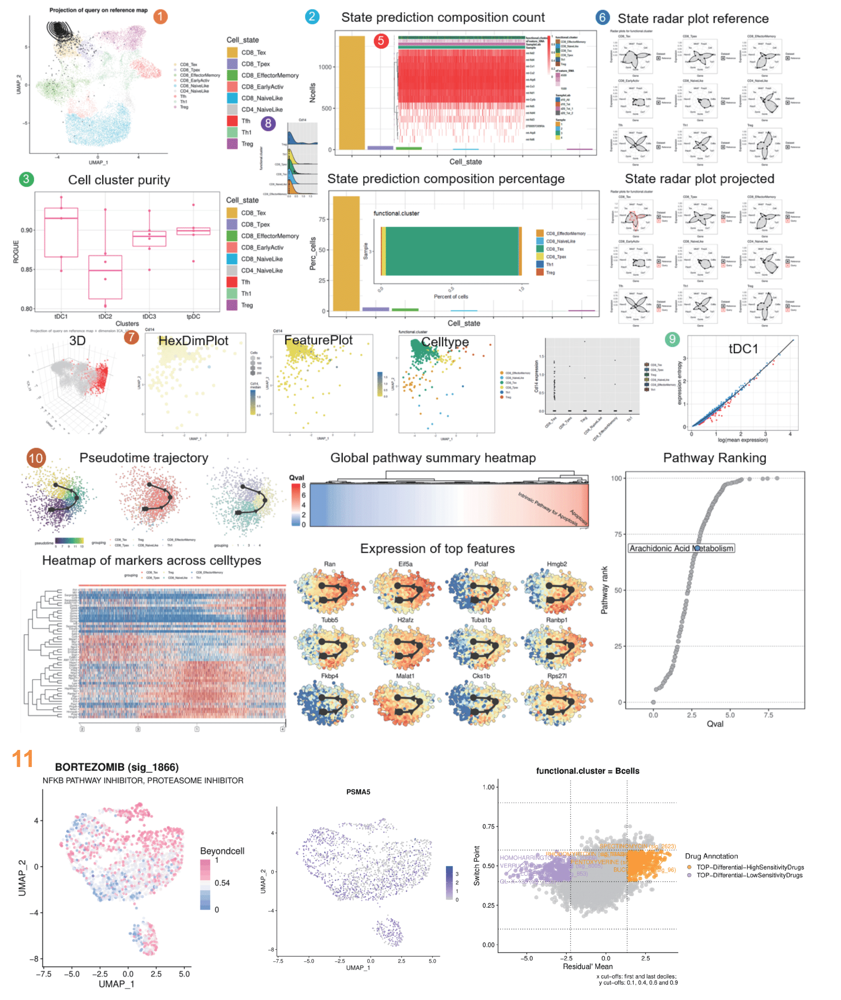

## ProjecTME: a framework for reference-based single-cell RNA-seq data analysis

ProjecTME is a computational method to project scRNA-seq data into reference single-cell atlaes, enabling their direct comparison in a stable, annotated system of coordinates. In contrast to other methods, ProjecTME allows not only accurately embedding new scRNA-seq data into a reference without altering its structure, but also characterizing previously unknown cell states that "deviate" from the reference ProjecTME accurately predicts the effect of cell perturbations and identifies gene programs that are altered in different conditions and tissues. We can use ProjecTME pre-defined cell type-specific reference maps or create our own for any cell type[s] of interest.



The pipeline contains the following functionalities:

- Projection of query data onto reference dataset;

- Building reference datasets based on known labels;

- Basic statistical analysis of cell populations (e.g., cell proportions vs. samples, cell purity, silhouette, etc);

- Differential gene expression and functional annotation analysis (GO, KEGG, REACTOME, etc);

- Pathway activity scoring system;

- Pseudotime trajectory and pathway ranking;

- Continue...

```r
# Run in R4.0 +
library(Seurat)
library(dplyr)
library(ggplot2)
source('script/main.r')
source('script/utils.r')
source('script/ext.r')
```

The pipeline takes advantages of [UCell](https://github.com/carmonalab/UCell) and [scGate](https://github.com/carmonalab/scGate) to perform gene signature scoring and marker-based purification.

#### Run

```r
load('data/query_example_seurat.RData')
ref <- load.reference.map()
projected <- Run.ProjecTME(query_example_seurat, ref = ref, fast.umap.predict = T)
plot.projection(ref = ref, query = projected)
circMarkCelltype(seu = projected,reduction = 'umap',annot = 'functional.cluster',sub = c('CD8_Tex'),palette = rainbow(6))
plot.statepred.composition(ref = ref, query = projected)
plot.states.radar(ref,projected)

# find discriminant dimensions
find.discriminant.dimensions(ref = ref, query = projected)
# visualization in 3D
plot.discriminant.3d(ref = ref, query = projected, extra.dim = "ICA_19")

# find discrininant genes
markers <- find.discriminant.genes(ref = ref, query = projected, state = 'Tex')
# volcano
library(EnhancedVolcano)
EnhancedVolcano(markers, lab = rownames(markers), x = 'avg_log2FC', y = 'p_val')

# calculate Silhouette coefficient
sil <- compute.silhouette(ref = ref, query = projected)

# calculate cluster purity
res <- compute.cluster.purity(
    query = projected, labels = projected$functional.cluster,
    samples = projected$SampleLab, platform = "UMI"
)

# find marker genes
Idents(projected) <- 'functional.cluster'
markers <- ProjecTME.find.markers(
    projected, groups = c('CD8_Tex','CD8_Tpex'),
    assay = 'RNA', slot = 'data', mu = 1, n_top_genes = 100
)
markers.name <- unique(markers$names$CD8_Tex, markers$names$CD8_Tpex)
top_list <- c()
for(group in colnames(markers$names)){
    top_i <- markers$names[group][1:10,1]
    top_list <- c(top_list, top_i)
}
htmap.colors <- colorRampPalette(rev(RColorBrewer::brewer.pal(10,'RdYlBu')))(50)
dittoHeatmap(
    projected, genes = markers.name, 
    annot.by = c('functional.cluster','Sample','SampleLab','nFeature_RNA'),
    scale.to.max = F, treeheight_row = 10, heatmap.colors = htmap.colors,
    show_rownames = F, highlight.features = top_list
)
# enrichment analysis
ProjecTME.enrichment(markers = markers, top_genes = 100, project = 'pbmc')

# calculate pathway activity score
projected <- ProjecTME.calculate_PAS(
    object = projected, method = 'AUCell', normalize = 'log',
    species = 'human', pathway = 'kegg'
)
markers <- ProjecTME.find.markers(
    projected,groups=c('CD8_Tex','CD8_Tpex'),assay='PAS',slot = 'data',
    mu = 1, n_top_genes = 100
)
top_list <- c()
for(group in colnames(markers$names)){
    top_i <- markers$names[group][1:5,1]
    top_list <- c(top_list, top_i)
}
DotPlot(projected, assay = 'PAS', features = unique(top_list)) + RotatedAxis()
DoHeatmap(projected,assay = 'PAS', features = top_list, slot = 'data')

# pseudotime
ProjecTME.pseudotime(
    seu = projected, n_var = 1000, ti_method = 'slingshot', root = F,
    root.markers = NULL, milestone_labelling = F, milestone_marker_lsit = NULL,
    add_dr = T, features = 'Gzmf', interest_features = NULL,
    cut_point = 2, gmt = 'reference/gmtFiles/mouse/reactome.gmt',
    highlight.pathways = 'mtorc', show.row.names = F,
    base.point.size = 2.5, highlight.point.size = 3
)

## Visualization
if(!require(dittoSeq)) BiocManager::install('dittoSeq')
library(dittoSeq)
# violin plot
dittoPlot(projected, 'Cd14', group.by = 'functional.cluster')
# jittered boxplot
dittoPlot(projected, 'Cd14', group.by = 'functional.cluster', plots = c('boxplot','jitter'))
# jittered ridgeplot
dittoPlot(projected, 'Cd14', group.by = 'functional.cluster', plots = c('ridgeplot','jitter'))
# Hex Dimplot
dittoDimHex(projected, 'Cd14')
# DimPlot
dittoDimPlot(projected, 'functional.cluster', size = 3)
# DimPlot (genes)
dittoDimPlot(projected, 'Cd14', size = 3)
# Cell proportion barplot
dittoBarPlot(projected, 'functional.cluster', group.by = 'Sample')
dittoBarPlot(projected, 'functional.cluster', group.by = 'Sample', scale = 'count')
# DimHeatmap
htmap.colors <- colorRampPalette(rev(RColorBrewer::brewer.pal(10,'RdYlBu')))(50)
dittoHeatmap(projected, genes = dittoSeq::getGenes(projected)[1:20],heatmap.colors = htmap.colors)
# binary heatmap
dittoHeatmap(
    projected,genes = dittoSeq::getGenes(projected)[1:20],
    annot.by = c('Sample','SampleLab','nFeature_RNA','functional.cluster'),
    scaled.to.max = T, treeheight_row = 10
)


```

The detailed tutorials were presented in **Vignettes**.
